# tubeviz

**tubeviz** turns a music track and a library of source footage into a beat-aligned,
AI-directed music video. It handles the whole production: finding and curating
footage, detecting scenes, analyzing the music, planning a visual arc, choosing
excerpts, composing layers and effects, previewing the result in a browser, and
rendering a final encoded video.

## Sample videos

Complete videos produced with tubeviz:

- [Tubeviz — Andrew Bayer feat. Alison May — Open End Resource (OCULA Remix)](https://youtu.be/8eqdMmgcG_4)
- [Tubeviz — Step It Up — Stereo MC's](https://youtu.be/nrYzxJzPYbE)

## Contents

- [Overview](#overview)
- [Requirements and installation](#requirements-and-installation)
- [FFglitch installation](#ffglitch-installation)
- [Quick start: Studio](#quick-start-studio)
- [Working in Studio](#working-in-studio)
- [Building a footage library](#building-a-footage-library)
- [Curating the library](#curating-the-library)
- [Analyzing music and building the edit](#analyzing-music-and-building-the-edit)
- [Visual direction](#visual-direction)
- [Vector scene graph](#vector-scene-graph)
- [FFglitch codec-space effects](#ffglitch-codec-space-effects)
- [Previewing interactively](#previewing-interactively)
- [Rendering a final video](#rendering-a-final-video)
- [Library layout](#library-layout)
- [Recommended four-minute EDM workflow](#recommended-four-minute-edm-workflow)
- [Troubleshooting](#troubleshooting)
- [Command reference](#command-reference)
- [Development](#development)
- [License](#license)

## Overview

Unlike an audio-reactive shader that changes parameters on a single image, tubeviz
reasons across the entire production. Source video stays primary; compositing,
transforms, vector treatments, and codec effects are scheduled around it.

The central artifact is a versioned, Pydantic-validated **directed timeline**: a JSON
plan that separates expensive or subjective decisions from playback and rendering. The
same plan can be inspected, served in the browser, re-cut against an updated library,
materialized into caches, or rendered by either backend without repeating the whole
workflow.

Five ideas shape the system:

- **Music-aware direction.** Beats, bars, variable tempo, onsets, sections, timbre,
  energy, motifs, phrase trajectories, and optional learned audio semantics all
  influence the edit.
- **Footage-first visuals.** Real source video carries the frame; effects support it.
- **Reusable local intelligence.** Normalized media, detected scenes, thumbnails,
  semantic embeddings, visual measurements, provenance, curation state, and trim ranges
  persist in a SQLite-backed library.
- **Deterministic plans, controllable variation.** A stored timeline is reproducible,
  while seeds, reshuffling, library replanning, and configurable novelty produce
  alternate cuts on purpose.
- **One engine, several interfaces.** Studio and the CLI invoke the same command
  implementation; preview and both render paths consume the same timeline model.

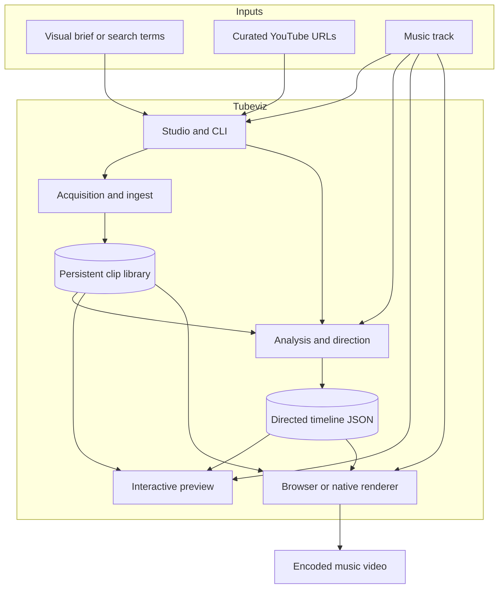

Studio is an orchestration layer, not a parallel implementation. Its curated workflows
and parser-generated Command Center launch validated CLI argument vectors. The CLI
coordinates the Python planning pipeline, external media tools, the FastAPI preview
service, and the native renderer.

## Requirements and installation

- Python **3.11+**
- FFmpeg / ffprobe
- yt-dlp (installed with the Python package)
- Chrome/Chromium plus Playwright, for the browser renderer only
- CMake, a C++20 compiler, pkg-config, and FFmpeg development libraries, for the native
  renderer only
- OpenCLIP dependencies, for semantic/AI visual selection only
- FFglitch **0.10.2** `ffedit`, for true codec-space motion-vector effects only.
  `fflive` and `ffgac` are optional and not used by tubeviz

### System packages

**Arch Linux / CachyOS:**

```bash
sudo pacman -S --needed \
  base-devel cmake pkgconf ffmpeg curl unzip chromium
```

**Debian / Ubuntu:**

```bash
sudo apt install \
  build-essential cmake pkg-config ffmpeg curl unzip chromium \
  libavformat-dev libavcodec-dev libavutil-dev libswscale-dev
```

`chromium` is needed only for browser preview and offline browser rendering when you are
not using Playwright's downloaded browser. The CMake/compiler and FFmpeg development
headers are needed only to build the native C++ renderer. FFglitch is installed
separately; it is not provided by tubeviz or Python packaging.

### Install

```bash
git clone <repo-url> tubeviz
cd tubeviz
python -m venv .venv
source .venv/bin/activate
pip install -e .
```

For semantic selection, AI ingest, learned audio analysis, browser rendering, and tests:

```bash
pip install -e '.[dev,semantic,audio-ai,render]'
```

Extras can be installed independently: `semantic` adds OpenCLIP and Pillow, `audio-ai`
adds PyTorch and Transformers for CLAP/MERT, `render` adds Playwright, and `dev` adds
test dependencies. Core DSP analysis, library management, preview serving, and native
rendering work without the learned-AI extras.

If you want Playwright's own Chromium:

```bash
playwright install chromium
```

Verify the installation:

```bash
tubeviz --help
ffmpeg -version
```

### Codec-cache filesystems and MP4 faststart

Codec-glitch shots are finalized in tubeviz's local temporary directory and only then
published to `library/codec-glitch/`. This keeps FFmpeg's `+faststart` in-place MP4
rewrite off NFS, FUSE, network, merger, and other mounted library filesystems. If the
optional faststart pass fails locally, tubeviz retries without it; cached shots do not
require a front-loaded `moov` atom. Cache publication uses a same-directory temporary
file plus `fsync` and atomic `os.replace`, so an interrupted materialization cannot
leave a partially written MP4 in place.

## FFglitch installation

FFglitch is **not** a Python dependency and is not installed by `pip`. tubeviz uses the
external `ffedit` executable for codec-space motion-vector materialization. The
supported release is **FFglitch 0.10.2**. In FFglitch's own documentation, `ffedit` is
the multimedia bitstream editor, `fflive` handles live playback/glitching, and `ffgac`
is an FFmpeg variant with extra glitch functionality. tubeviz requires only `ffedit`.

### Linux x86-64

The official prebuilt archive:

```text
https://ffglitch.org/pub/bin/linux64/ffglitch-0.10.2-linux-x86_64.zip
```

A user-local installation that leaves `/usr/local` untouched:

```bash
mkdir -p ~/.local/bin
tmpdir="$(mktemp -d)"
curl -L \
  https://ffglitch.org/pub/bin/linux64/ffglitch-0.10.2-linux-x86_64.zip \
  -o "$tmpdir/ffglitch.zip"
unzip -q "$tmpdir/ffglitch.zip" -d "$tmpdir/unpacked"
install -m 0755 \
  "$(find "$tmpdir/unpacked" -type f -name ffedit -print -quit)" \
  ~/.local/bin/ffedit
rm -rf "$tmpdir"

# Ensure ~/.local/bin is on PATH for this shell/session.
export PATH="$HOME/.local/bin:$PATH"

ffedit -h | head -40
tubeviz codec doctor
```

FFglitch's optional tools live in the same archive if you want them:

```bash
# Optional; tubeviz does not require these.
install -m 0755 "$(find /path/to/extracted-ffglitch -type f -name fflive -print -quit)" ~/.local/bin/fflive
install -m 0755 "$(find /path/to/extracted-ffglitch -type f -name ffgac -print -quit)" ~/.local/bin/ffgac
```

### Linux aarch64

```text
https://ffglitch.org/pub/bin/linux-aarch64/ffglitch-0.10.2-linux-aarch64.7z
```

Extract with `7z`, copy `ffedit` onto `PATH`, and verify with `tubeviz codec doctor`.

### macOS and Windows

Official FFglitch 0.10.2 archives are published for macOS x86-64, macOS Apple silicon,
and Windows x86-64. Install `ffedit` from the appropriate archive and put it on `PATH`
before starting tubeviz. See the FFglitch download page for current links.

### Diagnostics

```bash
command -v ffedit
ffedit -h | head -40
tubeviz codec doctor
```

If `tubeviz codec doctor` reports FFglitch as unavailable, analysis, preview, vector
effects, and rendering all still work — only true codec materialization is unavailable.

## Quick start: Studio

Studio is the fastest way to work with tubeviz:

```bash
tubeviz gui \
  --project-root /DATA/git/tubeviz \
  --library /DATA/git/tubeviz/library
```

It opens `http://127.0.0.1:8090/` by default.

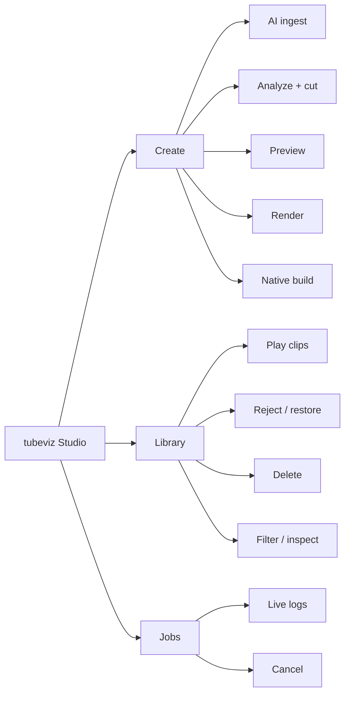

Other launch options:

```bash
tubeviz gui --library ./library --port 8095
tubeviz gui --library ./library --no-open
tubeviz gui --host 0.0.0.0 --port 8090
```

Studio runs the same CLI workflows described below; it is not a separate rendering
implementation. The header displays the running tubeviz version, and Studio assets are
served with no-cache behavior so a restarted Studio process serves current assets
immediately.

## Working in Studio

### Interfaces

Studio offers two complementary surfaces:

1. the curated **Create** and **Library** panels, for frequent workflows; and
2. the generated **Command Center**, which mirrors the `argparse` command tree and
   exposes every non-GUI CLI command and option.

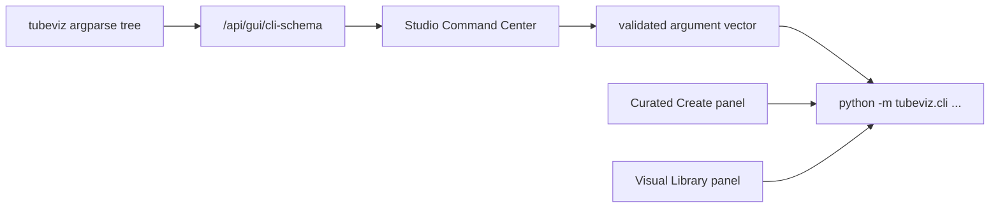

The Command Center is generated from the parser rather than from a second
hand-maintained option list, so any option available on commands such as `analyze`,
`render`, `serve`, `codec materialize`, `library embed`, or `ingest` appears in Studio.
Commands launch as argument vectors, without shell interpolation.

Generated command coverage:

```text
tubeviz ingest
tubeviz ingest-url
tubeviz library list
tubeviz library show
tubeviz library reject
tubeviz library restore
tubeviz library delete
tubeviz library stats
tubeviz library ai-report
tubeviz library visual-index
tubeviz library codec-motion-index
tubeviz library embed
tubeviz audio-ai doctor
tubeviz audio-ai inspect
tubeviz analyze
tubeviz materialize
tubeviz render
tubeviz codec doctor
tubeviz codec inspect
tubeviz codec materialize
tubeviz native build
tubeviz native doctor
tubeviz serve
```

`tubeviz gui` is intentionally not launchable from Command Center, since the running
Studio process already owns the GUI.

Select any command and click **Use current Project paths** to copy the Studio Library,
Audio, Timeline, Output, and Search Terms fields into matching CLI arguments. The
argument-vector preview shows the exact command before it launches. Advanced commands
use the same cancellable job manager and live log as the curated controls.

### Contextual help

Form controls carry inline `?` help affordances. Hover or focus a help icon for
tubeviz-specific guidance; Command Center controls draw their help, defaults, and
choices from the CLI parser, so GUI help stays synchronized with the command line. Help
bubbles render in a document-level floating layer with viewport clamping and automatic
above/below placement, so panel overflow and scrolling cannot crop them. Press
**Escape** to dismiss a focused tooltip.

### Jobs and progress

Long-running jobs report their current stage, elapsed time, and live log. Operations
with a known unit count — rendered frames, indexed scenes, CLAP windows, input URLs,
search terms, codec shots, downloaded bytes — also show a percentage, completed/total
count, and an ETA when the underlying process supplies one. Work such as initial model
loading or DSP analysis uses an indeterminate progress bar until a measurable stage
begins. Python workers run unbuffered, so messages appear as they happen rather than
sitting in stdout buffers.

### AI Settings

The **AI Settings** tab is the single control surface for learned features. The master
**Enable AI features throughout Tubeviz** switch gates AI-assisted acquisition and final
analysis jobs; a separate storyboard switch controls paid OpenAI video-description
requests. The same screen configures the OpenAI API key, Hugging Face token,
OpenAI-compatible base URL, vision model, image detail, frame budget, and timeout.
Saved secret values are never sent back to the browser.

Settings persist outside the repository at `~/.config/tubeviz/config.json` (or
`$XDG_CONFIG_HOME/tubeviz/config.json`). Set `TUBEVIZ_CONFIG` to use another path.
Tubeviz creates the file with user-only `0600` permissions. Saved credentials are
injected only into child-process environments and are excluded from job commands, logs,
and API responses. `OPENAI_API_KEY`, `HF_TOKEN`, and `HUGGING_FACE_HUB_TOKEN` act as
fallbacks when the corresponding saved field is empty.

#### Hugging Face authentication

OpenCLIP and CLAP model downloads work without authentication for public models, but a
Hugging Face token helps with authenticated, gated, or rate-limited Hub access. The
preferred environment variable is `HF_TOKEN`. Studio reports whether a token is already
available from its environment; if not, expand **Project → AI credentials** and enter
one there. The Studio token is deliberately ephemeral — it is passed only to tubeviz
child processes as `HF_TOKEN` and never appears in command-line arguments, job metadata,
or job logs. Leaving the field blank inherits the Studio server environment.

For a persistent shell setup:

```bash
export HF_TOKEN='hf_...'
tubeviz gui --library ./library
```

A read token is sufficient for downloading models.

### Video understanding

Vision description is opt-in, because image inputs consume API tokens. When enabled,
each completed ingest is enhanced automatically, and the **Enhance Existing Library**
action backfills every ready clip already in the library without downloading or
normalizing it again. Cache keys include the normalized-media checksum, model, detail
level, prompt version, and sampled scene indexes, so unchanged clips are free to skip.
Enable **Re-analyze cached clips** only when changing the desired interpretation or
deliberately refreshing model output.

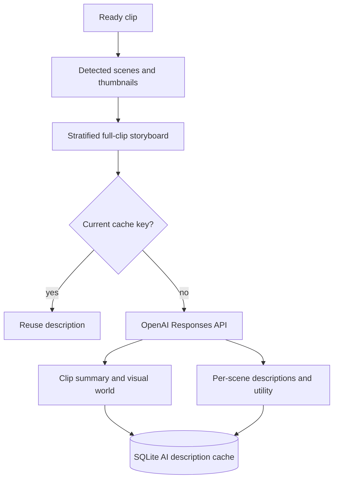

The request sends all sampled thumbnails as one scene-labelled storyboard. The
structured result covers visible subjects, actions, locations, camera language, palette,
lighting, texture, mood, risks, semantic tags, and editing utility. Per-scene values
include energy, motion, complexity, continuity, and fit for builds, drops, and ambient
passages. Tubeviz stores both the clip-level analysis and the scene rows, so an existing
library gains the same capabilities as freshly ingested footage.

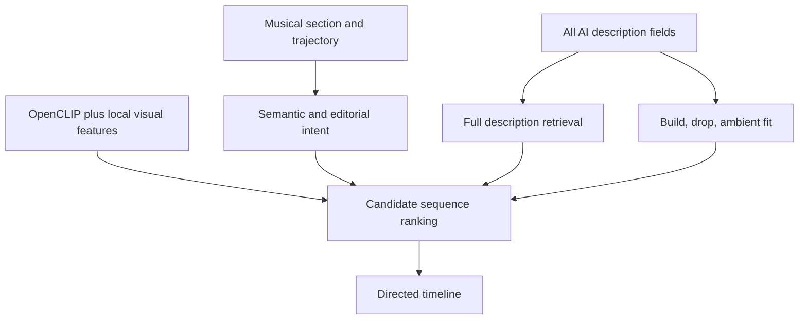

This is not display-only metadata. Final scene planning searches the complete
description corpus and blends the appropriate editing-utility score into section
ranking. Local OpenCLIP embeddings, measured motion/palette/complexity, transition
quality, novelty, curation preferences, and deterministic timing all remain active, so
remote descriptions enrich the existing analysis rather than replacing it.

Command-line backfill uses the same configuration and cache:

```bash
tubeviz library ai-describe --library ./library
tubeviz library ai-describe --library ./library --limit 10
tubeviz library ai-describe --library ./library --clip-id 42 --force
```

Progress is emitted per clip: current clip/total, sampled-frame count, cache hits,
stored results, and failures. Studio maps those lines onto its active-job stage and
progress display and keeps the detailed log for diagnosis.

### Play / Trim editor

Studio can non-destructively mark the usable portion of any local library video — useful
for footage with title cards, channel intros, credits, black leader, talking-head
introductions, or anything else that should never enter a visualization.

Open **Library**, choose **Play / Trim**, then use the visual editor:

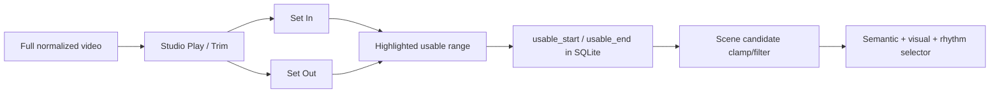

The editor provides:

- two draggable In/Out handles over the clip timeline;
- detected-scene boundary ticks and a live playhead marker;
- **Set In to Playhead** and **Set Out to Playhead**;
- jump-to-In and jump-to-Out controls;
- automatic looping of the currently kept range;
- millisecond readouts for In, Out, and kept duration;
- **Save In / Out** and **Clear Trim**;
- a visible trim badge on library cards.

Trimming is non-destructive: tubeviz does not rewrite or re-encode the normalized video.
The saved bounds only define which source times are eligible for future scene plans. A
90-second clip with a 7.5-second intro stays physically unchanged while Studio stores:

```text
usable_start = 7.500
usable_end   = 90.000
```

A detected scene that crosses a trim boundary is clipped rather than discarded, as long
as enough usable duration remains:

```text
indexed scene:   4.0 -------- 12.0
saved usable:        7.5 ----------------
selector sees:       7.5 ---- 12.0
```

Scenes entirely before or after the usable range disappear from scene selection.
`--min-play-scene-seconds` and related minimum-duration checks apply to the **remaining**
duration after trimming.

Visual motion-accent metadata is shifted and filtered for a partially trimmed scene, so
beat/motion alignment cannot seek back into an excluded intro. The persistent full-scene
visual fingerprint stays intact, so changing or clearing a trim does not require
rebuilding the visual feature index. Library thumbnails prefer the first scene inside the
saved usable range, so a trimmed title card is not used as the primary thumbnail when a
later scene thumbnail exists.

Timeline JSON is immutable, so a timeline generated before a trim still references its
old source range. Regenerate or replan scenes after curating:

```bash
tubeviz analyze song.mp3 \
  --library ./library \
  --semantic \
  --output song.timeline.json
```

or, for interactive preview:

```bash
tubeviz serve song.timeline.json \
  --audio song.mp3 \
  --library ./library \
  --replan-scenes
```

### Preview from Studio

Preview servers are managed per launch. **Start Preview**:

1. reads the current Timeline, Audio, and Library fields from Studio;
2. retires the previous Studio-managed preview process;
3. allocates a fresh local TCP port;
4. starts `tubeviz serve` with the currently selected paths; and
5. waits for Uvicorn startup before navigating the reusable preview tab.

Each preview therefore reflects the paths currently selected in Studio rather than a
stale in-memory timeline held by an earlier server on a fixed port. Studio subprocesses
run with `--project-root` as their working directory, so relative Timeline, Audio, and
Library paths resolve against the selected project. The preview job payload records
`preview_timeline`, `preview_audio`, `preview_library`, and `preview_url`, and
`/api/status` reports the timeline and audio currently loaded by the visualizer server.

## Building a footage library

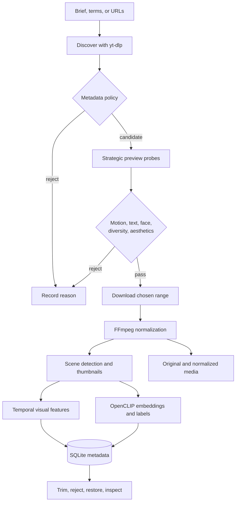

Automatic discovery uses progressively more expensive gates: cheap metadata screening
comes first, then partial media probes, and full download and indexing is reserved for
footage that survives the quality checks. Explicit `ingest-url` sources skip search
ranking but run the same downstream normalization, scene, feature, and semantic-indexing
pipeline.

Active, upcoming, and post-live streams are rejected. Archived finite VODs remain usable
when yt-dlp exposes suitable media.

### Theme-first acquisition with a visual brief

Search-term files are supported, but the recommended ingest path is a natural-language
**visual brief**. Tubeviz combines the brief with the song's DSP analysis and a summary
of the existing library, asks an OpenAI-compatible LLM for a structured acquisition plan,
and then spends compute and bandwidth only on candidates that survive each gate.

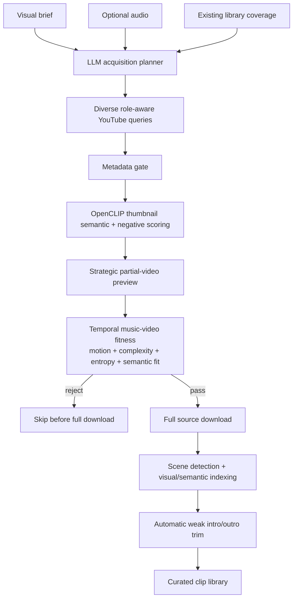

```bash
tubeviz ingest \
  --visual-brief 'Dark futuristic techno: neon tunnels, liquid chrome, rhythmic machinery, surreal architecture, rave silhouettes and euphoric high-motion drops. Avoid text, logos, talking heads, tutorials and static footage.' \
  --audio audio/connected.mp3 \
  --library ./library \
  --target-clips 40 \
  --acquisition-query-count 24 \
  --ai-llm-base-url http://localhost:8000/v1 \
  --ai-llm-model YOUR_MODEL \
  --preview-gate \
  --preview-samples 4 \
  --preview-seconds 4 \
  --min-video-fitness 0.18 \
  --auto-trim
```

`--visual-brief` enables AI discovery and the preview gate automatically. The acquisition
planner distributes the overall target across its generated searches rather than treating
each query as an independent large quota. Without a configured LLM, tubeviz falls back to
a deterministic cinematography-oriented planner.

The preview gate samples strategic points across each hydrated candidate before
committing to a full download. OpenCLIP evaluates the preview against positive visual
concepts and explicit negative concepts such as title cards, logos, talking heads,
tutorials, presentations, and static footage. Temporal visual analysis separately
measures useful motion, motion variation, complexity, entropy, and cut activity. Together
these form a music-video fitness score, and low-fitness candidates are rejected before
the expensive ingest path.

Once accepted footage is normalized and scene-indexed, `--auto-trim` moves the saved
usable In/Out points past low-fitness edge scene runs, suppressing common title and logo
lead-ins and static credit or outro material. The Studio trim editor remains available
for correction or override.

Studio exposes the same workflow under **AI Ingest**, with a visual brief editor, an
optional terms file, acquisition-query count, preview gate, minimum video fitness, and
AI auto-trim controls.

### Search-term ingest

`search_terms.txt` holds one visual concept per line:

```text
underground techno warehouse strobe
laser tunnel rave crowd
analog CRT glitch surveillance
industrial machinery sparks
cyberpunk city rain neon
abstract liquid chrome macro
satellite earth night timelapse
high speed train tunnel POV
```

Basic ingest:

```bash
tubeviz ingest \
  --terms search_terms.txt \
  --library ./library \
  --results-per-term 10 \
  --cookies-from-browser chrome
```

AI-assisted ingest:

```bash
tubeviz ingest \
  --terms search_terms.txt \
  --library ./library \
  --results-per-term 10 \
  --cookies-from-browser chrome \
  --ai-discovery \
  --ai-query-expansion \
  --ai-query-count 8 \
  --ai-candidates-per-term 100 \
  --ai-device auto \
  --ai-index-scenes
```

A more permissive source-duration configuration:

```bash
tubeviz ingest \
  --terms search_terms.txt \
  --library ./library \
  --results-per-term 10 \
  --search-pool 50 \
  --max-search-pool 500 \
  --search-pool-step 50 \
  --preferred-max-duration 1200 \
  --hard-max-duration 0 \
  --scene-threshold 0.40 \
  --min-scene-seconds 1.5 \
  --download-socket-timeout 20 \
  --concurrent-fragments 4 \
  --download-retries 2 \
  --fragment-retries 2 \
  --cookies-from-browser chrome
```

Important ingest controls:

| Option | Purpose |
|---|---|
| `--results-per-term N` | Desired READY clips per seed term |
| `--search-pool N` | Initial search result window |
| `--max-search-pool N` | Maximum progressively expanded search window |
| `--search-pool-step N` | Expansion step when the READY quota is not filled |
| `--min-duration S` | Reject clips shorter than this |
| `--preferred-max-duration S` | Soft preference for shorter videos; `0` disables |
| `--hard-max-duration S` | Hard rejection limit; `0` disables |
| `--min-width PX` | Reject narrow video; `0` disables |
| `--min-source-height PX` | Reject sources below this height; default `1080` |
| `--max-source-height PX` | Cap the downloaded source representation; default `1080`, `0` disables |
| `--width/--height/--fps` | Normalized media format |
| `--scene-threshold` | FFmpeg scene-change sensitivity |
| `--min-scene-seconds` | Minimum indexed scene duration |
| `--keep-audio` | Retain AAC audio in normalized clips |
| `--no-scenes` | Skip scene detection/thumbnails |
| `--force` | Reprocess already-ready clips |
| `--cookies-from-browser BROWSER` | Use browser cookies through yt-dlp |
| `--ai-discovery` | Rank candidates visually before downloading |
| `--ai-query-expansion` | Expand seed concepts into diverse searches |
| `--ai-query-count N` | Number of expanded searches |
| `--ai-candidates-per-term N` | Candidate pool scored before download |
| `--ai-model/--ai-pretrained` | OpenCLIP configuration |
| `--ai-device auto\|cpu\|cuda...` | AI execution device |
| `--ai-diversity-weight` | Penalize visually redundant candidates |
| `--ai-near-duplicate-threshold` | Similarity threshold for near duplicates |
| `--ai-negative-weight` | Strength of undesirable-content penalty |
| `--ai-metadata-weight` | Metadata contribution to ranking |
| `--ai-min-score` | Reject AI candidates below score |
| `--ai-negative-concepts` | Comma-separated concepts to penalize |
| `--ai-llm-base-url/--ai-llm-model` | Optional OpenAI-compatible query-expansion model |
| `--ai-index-scenes` | Embed detected scenes while the AI model is loaded |
| `--verbose-ytdlp` | Expose detailed yt-dlp diagnostics |

### Adding specific YouTube clips

When you already know the exact source footage you want, bypass search and AI discovery:

```bash
tubeviz ingest-url \
  'https://www.youtube.com/watch?v=VIDEO_ID' \
  --library ./library
```

Multiple URLs in one invocation:

```bash
tubeviz ingest-url URL1 URL2 URL3 --library ./library --term hand-picked
```

Manual URL ingestion runs the full scene-understanding pipeline by default: yt-dlp
metadata extraction, duplicate detection, download, FFmpeg normalization, scene
detection, thumbnails, decoded temporal visual-feature indexing, OpenCLIP scene
embeddings, and zero-shot semantic classification. Scene labels cover concepts such as
crowd, dancing, nightlife, city, tunnel, transport, industrial, architecture, abstract,
lights, moving POV, macro, and fire/smoke, plus negative classes such as text-heavy,
talking-head, and static-presentation.

The same browser-cookie and network controls are available:

```bash
tubeviz ingest-url 'https://youtu.be/VIDEO_ID' \
  --library ./library \
  --term head-at-curated \
  --cookies-from-browser chrome \
  --scene-threshold 0.40 \
  --min-scene-seconds 1.5
```

`--hard-max-duration` defaults to `0` (disabled) here, because an explicitly chosen
source should not be rejected merely for exceeding the normal discovery policy. Pass
`--hard-max-duration` when you do want that guardrail. `--force` reprocesses an existing
clip.

In Studio, the Create panel includes **Manual YouTube URL Ingest**: a multi-line editor
taking one URL per line, plus an optional provenance term such as `hand-picked`,
`head-at-curated`, or `industrial-favorites`. Uncommon network and normalization
settings sit under **Advanced ingest settings**. The visual form exposes the complete
`ingest-url` workflow:

```text
provenance term
minimum / hard maximum duration
minimum source width
normalization width / height / FPS
scene-change threshold
minimum scene duration
browser cookies
network timeout
fragment concurrency and retries
keep audio
skip scene detection
skip temporal visual indexing
OpenCLIP semantic device / model / weights
skip semantic embeddings
skip automatic scene classification
force reprocessing
verbose yt-dlp
```

The resulting clips enter the same persistent library pipeline as searched clips:
metadata, duplicate checks, download, normalization, scene indexing, thumbnails, visual
fingerprints, trimming, semantic embeddings, and later selection are all shared.

## Curating the library

```bash
tubeviz library stats --library ./library
tubeviz library list --library ./library --limit 50
tubeviz library list --library ./library --status ready --term "warehouse"
tubeviz library list --library ./library --json
tubeviz library show VIDEO_ID --library ./library
tubeviz library show VIDEO_ID --library ./library --json
```

Reject without deleting:

```bash
tubeviz library reject VIDEO_ID \
  --library ./library \
  --reason "static talking-head footage"
```

Restore:

```bash
tubeviz library restore VIDEO_ID --library ./library
```

Preview a destructive deletion first:

```bash
tubeviz library delete VIDEO_ID --library ./library --dry-run
```

Delete it:

```bash
tubeviz library delete VIDEO_ID --library ./library
```

Delete without confirmation:

```bash
tubeviz library delete VIDEO_ID --library ./library --yes
```

Keep the downloaded original while removing tracked derived assets and metadata:

```bash
tubeviz library delete VIDEO_ID --library ./library --keep-original
```

Inspect persisted AI ranking:

```bash
tubeviz library ai-report --library ./library --limit 50
tubeviz library ai-report --library ./library --term "laser tunnel" --limit 25
```

Embed existing scene thumbnails:

```bash
tubeviz library embed --library ./library --device auto
```

Force regeneration:

```bash
tubeviz library embed \
  --library ./library \
  --model ViT-B-32 \
  --pretrained laion2b_s34b_b79k \
  --device cuda \
  --batch-size 64 \
  --force
```

Clip status and provenance are retained even for rejected candidates. The
non-destructive `usable_start` and `usable_end` bounds let you exclude weak intros,
outros, title cards, and other unwanted regions without rewriting the source or
invalidating its stable scene fingerprints.

## Analyzing music and building the edit

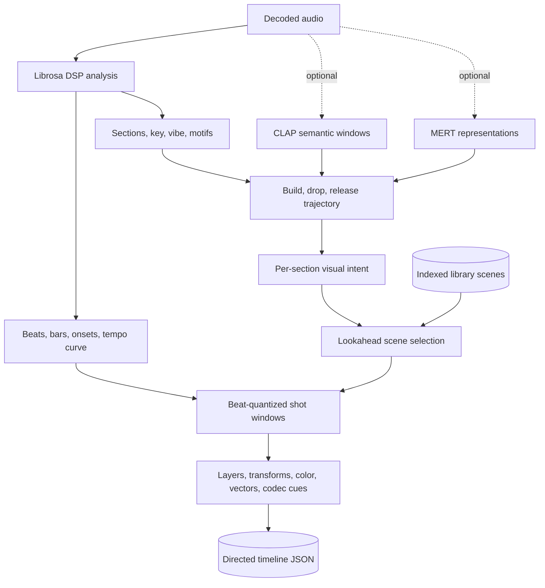

The selector evaluates sequences rather than isolated clips. Semantic relevance, phrase
trajectory, motion and effect compatibility, transition quality, learned curation
preferences, novelty, reuse cooldowns, and deterministic variation all contribute to the
selected path. Edits stay quantized to the musical grid even when optional AI supplies
higher-level treatment ideas.

A good default analysis:

```bash
tubeviz analyze audio/connected.mp3 \
  --library ./library \
  --semantic \
  --semantic-device auto \
  --section-bars 8 \
  --max-video-layers 3 \
  --composition-intensity 1.2 \
  --transform-intensity 1.2 \
  --dynamic-shots \
  --min-shot-seconds 0.65 \
  --max-shot-seconds 6 \
  --source-excerpt-max-seconds 5 \
  --target-unique-clips 0 \
  --novelty-weight 0.65 \
  --reshuffle \
  --output timelines/connected.json
```

`--target-unique-clips 0` scales the desired source diversity to track duration and
available library size. A selected indexed scene does **not** have to play in full:
`--source-excerpt-max-seconds` caps the source interval used for a single visual shot.

A reproducible alternate cut:

```bash
tubeviz analyze audio/connected.mp3 \
  --library ./library \
  --semantic \
  --selection-seed 48151623 \
  --selection-variation 0.30 \
  --output timelines/connected-seed.json
```

Another randomized cut:

```bash
tubeviz analyze audio/connected.mp3 \
  --library ./library \
  --semantic \
  --reshuffle \
  --output timelines/connected-alt.json
```

Key analysis groups:

| Controls | Options |
|---|---|
| Audio analysis | `--sample-rate`, `--hop-length`, `--beats-per-bar` |
| Musical sections | `--section-bars`, `--section-seconds` |
| Variable BPM | `--tempo-window-seconds`, `--tempo-smoothing-seconds`, `--tempo-curve-seconds`, `--tempo-change-bpm`, `--min-tempo`, `--max-tempo`, `--tempo-octave-min`, `--tempo-octave-max` |
| Scene selection | `--library`, `--scene-crossfade`, `--clip-opacity`, `--min-play-scene-seconds` |
| Semantic retrieval | `--semantic`, `--semantic-model`, `--semantic-pretrained`, `--semantic-device` |
| Effects | `--no-transforms`, `--transform-intensity`, `--max-video-layers`, `--composition-intensity` |
| Alternate cuts | `--selection-seed`, `--selection-variation`, `--reshuffle` |
| Diversity | `--target-unique-clips`, `--novelty-weight`, `--novelty-candidate-fraction`, `--clip-reuse-cooldown`, `--scene-reuse-cooldown` |
| Dynamic editing | `--dynamic-shots`, `--min-shot-seconds`, `--max-shot-seconds`, `--source-excerpt-max-seconds` |
| Vector direction | `--vector-effects`, `--vector-intensity` |

### Variable BPM and vibe

A long mix is not treated as a single immutable BPM. Analysis persists a local tempo
curve and emits tempo-change events after sufficiently large local shifts. Musical
direction also draws on section energy, brightness, onset density, spectral and timbral
information, motif recurrence, and structural position to drive scene intent, edit
density, composition, and transform intensity.

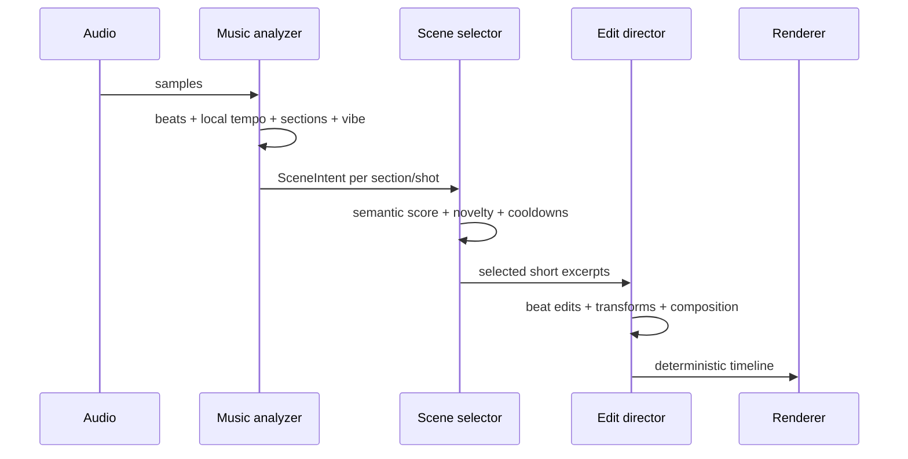

### Phrase-aware choreography

The choreography layer reasons about **where the music is going**, not only what is
happening at the current instant. Each section receives a trajectory:

```text
tension / tension slope
build probability
drop probability
release probability
time to next peak
anticipation
pre-drop withholding
motion / complexity / contrast / edit-density targets
```

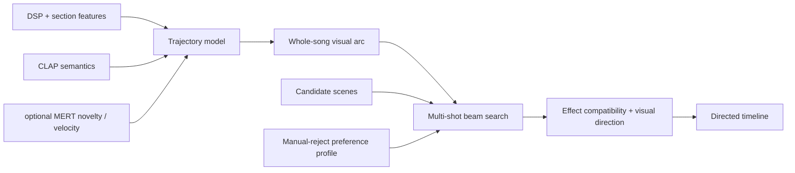

Phrase-aware choreography is enabled by default. Useful controls:

```bash
--choreography
--trajectory-strength 0.85
--anticipation-seconds 12
--visual-arc-strength 0.70
--sequence-lookahead 5
--sequence-beam-width 6
--sequence-candidate-pool 18
--trajectory-weight 0.85
--anticipation-weight 0.75
--effect-compatibility-weight 0.60
--preference-learning
--preference-weight 0.35
```

The sequence optimizer keeps several possible edits alive over a short horizon and scores
the **sequence**, including how its motion, complexity, and transition contrast evolve
toward an approaching payoff. Musical timing stays beat-aligned and deterministic.

A strong build therefore tends to progress like:

```text
wide / clean / longer
        ↓
more motion
        ↓
more visual complexity
        ↓
shorter beat-aligned shots
        ↓
stronger transition contrast
        ↓
brief pre-drop withholding
        ↓
DROP: high-contrast source change + impact treatment
```

Inspect the stored plan:

```bash
tubeviz choreography inspect timelines/connected.json
tubeviz choreography inspect timelines/connected.json --json
```

### Audio-semantic AI choreography

A second AI layer sits above the deterministic rhythm, variable-BPM, visual-fingerprint,
and motif systems. It uses CLAP to interpret overlapping windows of the actual music,
projects those audio semantics onto the same curated concept vocabulary used to
interrogate OpenCLIP scene embeddings, and then lets the existing optimizer choose real
library footage.

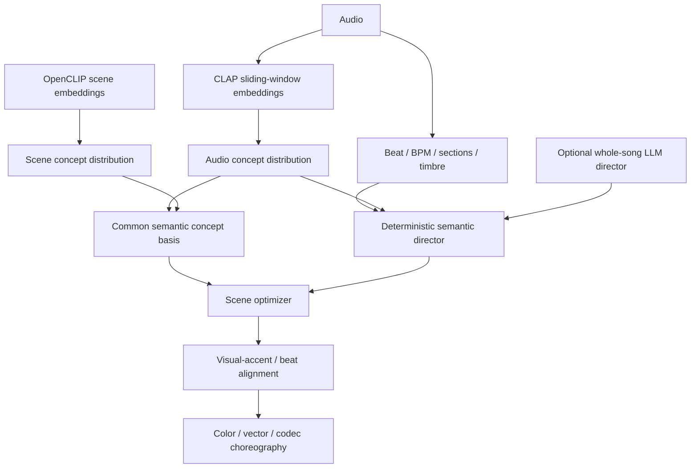

Install the optional runtime:

```bash
pip install -e '.[semantic,audio-ai,render]'
```

Check CUDA and Transformers availability:

```bash
tubeviz audio-ai doctor
```

After analysis, inspect what the model heard and how each section was directed:

```bash
tubeviz audio-ai inspect timelines/connected-ai.json
```

A solid AI-directed analysis:

```bash
tubeviz analyze audio/connected.mp3 \
  --library ./library \
  --semantic \
  --semantic-device cuda \
  --audio-ai \
  --audio-ai-device cuda \
  --audio-ai-window 8 \
  --audio-ai-hop 4 \
  --audio-visual-match-weight 1.10 \
  --visual-match-weight 1.35 \
  --transition-weight .55 \
  --rhythm-alignment \
  --vector-intensity .65 \
  --transform-intensity .85 \
  --composition-intensity .75 \
  --min-shot-seconds 1.0 \
  --max-shot-seconds 6 \
  --reshuffle \
  --output timelines/connected-ai.json
```

CLAP analysis defaults to `laion/clap-htsat-fused`. Audio is resampled to 48 kHz and
analyzed in overlapping windows. Results are cached under `~/.cache/tubeviz/audio-ai/`,
so alternate reshuffles do not rerun the model unless `--audio-ai-force` is supplied.

Each window and musical section receives a probability distribution over a shared
audio/visual concept basis covering mood, movement, visual world, texture, palette, and
cinematography — concepts such as `hypnotic`, `industrial`, `forward_motion`, `rave`,
`cold_blue`, `liquid`, `architecture`, `wide`, and `fragmented`.

The cross-modal match deliberately does **not** cosine CLAP vectors directly against
OpenCLIP vectors, since those models occupy different embedding spaces. Instead:

```text
CLAP(audio)      -> scores over shared text concepts
OpenCLIP(scene)  -> scores over the same text concepts
                           ↓
                distribution affinity
```

Affinity is weighted by CLAP confidence, so high-entropy or ambiguous audio semantics
have less power to override the deterministic visual and rhythm matchers.

The semantic director also turns CLAP results into section-level targets for:

```text
visual world
motion style / desired motion
visual complexity
edit density
transition continuity vs contrast
palette / target hue
effect family
vector intensity
codec-glitch intensity
```

Edit density is quantized back onto musical beat counts, so AI can ask for a more urgent
or more spacious montage but cannot move cuts off the beat grid.

Studio exposes CLAP enable/device/window/hop settings, the audio-to-visual match weight,
optional whole-song director URL/model/strength, and an **Audio AI Doctor** action.

### Optional whole-song LLM director

For a higher-level narrative arc, tubeviz can send a compact section summary to any
OpenAI-compatible chat-completions endpoint. The model is asked for themes and treatment
only: it cannot select filenames, clip IDs, or exact cut times.

```bash
tubeviz analyze audio/connected.mp3 \
  --library ./library \
  --semantic \
  --audio-ai \
  --ai-director \
  --ai-director-base-url http://localhost:8000/v1 \
  --ai-director-model my-local-model \
  --ai-director-strength .70 \
  --output timelines/connected-ai-directed.json
```

If authentication is required:

```bash
--ai-director-api-key "$OPENAI_API_KEY"
```

The returned JSON is schema-validated and unknown fields are discarded. The LLM plan is
blended with the deterministic CLAP baseline, and low CLAP confidence reduces how
strongly the language model may redirect a section. Plans are cached under
`~/.cache/tubeviz/ai-director/`.

The authority split is:

```text
LLM / CLAP:     what should this passage feel and look like?
tubeviz:        which actual library scenes best satisfy that intent?
rhythm engine:  exactly where should cuts and accents land?
renderer:       how should pixels, vectors and codec effects execute it?
```

### Optional MERT music representations

CLAP is tubeviz's audio/text semantic model. MERT serves a different purpose:
music-specific representation **dynamics**. With MERT enabled, tubeviz measures how
rapidly the learned musical state is changing and how novel a section is relative to the
one before it. Abrupt representation changes support a visual-world change; stable
embeddings favor continuity.

```bash
tubeviz analyze song.mp3 \
  --library ./library \
  --music-ai \
  --music-ai-model m-a-p/MERT-v1-95M \
  --music-ai-device auto \
  --music-ai-window 8 \
  --music-ai-hop 4 \
  --audio-ai \
  --semantic \
  --output song.json
```

Check the optional runtime and device first:

```bash
tubeviz music-ai doctor
```

MERT's Hugging Face model implementation requires `trust_remote_code=True`, so tubeviz
keeps it explicitly opt-in. The `m-a-p/MERT-v1-95M` weights are separately licensed
(CC-BY-NC-4.0 on the model card) and are **not** redistributed by tubeviz. Review the
model's license before using it in a commercial workflow.

### CUDA compatibility-aware `auto`

`torch.cuda.is_available()` does not guarantee that an installed PyTorch wheel contains
kernels for the actual GPU. tubeviz compares `torch.cuda.get_device_capability()` with
`torch.cuda.get_arch_list()` before selecting CUDA automatically. A Pascal `sm_61` GPU
paired with a wheel that only ships `sm_75+` kernels therefore falls back to CPU rather
than failing inside CLAP, OpenCLIP, or MERT inference.

## Visual direction

### Video-first effects

tubeviz transforms **rendered video** rather than placing small rectangular clips over a
conventional procedural visualizer.

Depending on backend support and timeline direction, the effect system includes:

- crop/zoom/pan, mirror, rotation, playback-rate treatment;
- brightness, contrast, saturation, hue, grayscale, blur and posterization;
- feedback and recursive video tunnels;
- pixelation and RGB/chromatic displacement;
- glitch slicing and block displacement;
- scanlines, vignette and VHS-style tracking;
- ripple and beat-driven warping;
- organic mirrored/kaleidoscopic deformation rather than a persistent centered square;
- slit-scan and delayed-frame echoes;
- chroma delay and motion trails;
- datamosh-like delayed block copying;
- mask wipes, vortex treatment and slice recursion;
- multi-source single/split/mosaic/luma/strip compositions;
- beat/bar/onset/drop-driven retriggers, jumps, freezes, focus changes and effect pulses.

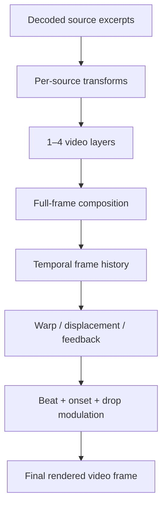

### Visual Director: motion, palette, rhythm, narrative

Every indexed scene carries a persistent temporal visual fingerprint. New ingests build
it automatically, and existing libraries are backfilled on the next `analyze` or scene
replan unless disabled.

Index manually:

```bash
tubeviz library visual-index \
  --library ./library
```

Force a complete rebuild:

```bash
tubeviz library visual-index \
  --library ./library \
  --fps 6 \
  --max-frames 180 \
  --force
```

Each scene fingerprint includes:

```text
brightness + variance
saturation
dominant hue
warmth
5-color source palette
visual complexity
visual entropy
motion magnitude / peak / entropy
approximate global motion direction
internal cut/change rate
natural visual motion accents
```

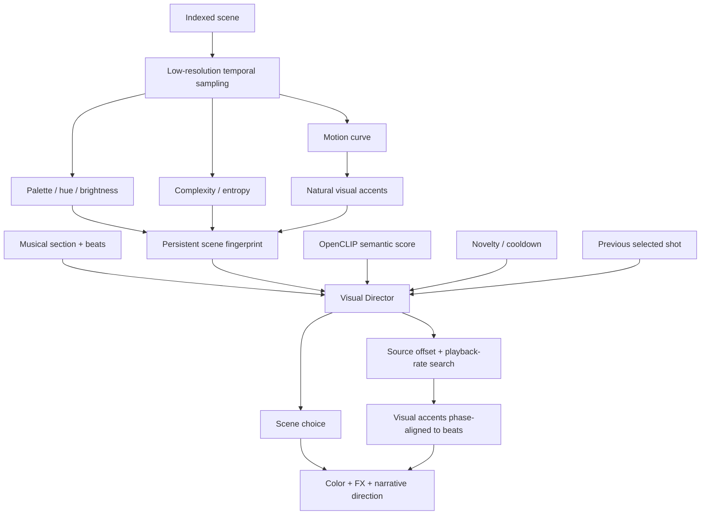

Scene ranking combines:

```text
semantic relevance
+ visual motion compatibility
+ brightness / complexity / saturation compatibility
+ novelty and unique-source pressure
+ recent scene/clip cooldown
+ transition continuity or contrast
+ motif memory
```

Transition behavior is musical: breakdowns and hypnotic passages prefer visual
continuity, while peaks, heavy or fractured sections, and payoffs reward stronger color,
motion, and brightness contrast.

Natural visual accents drive a search over source offsets and modest playback rates, so
motion already present in the footage can land on musical beats. Camera whips, flashes,
machine movement, and dancer movement can feel synchronized even though the source
footage has nothing to do with the song.

Controls:

```text
--visual-match-weight 1.25
--transition-weight 0.70
--rhythm-alignment / --no-rhythm-alignment
--visual-auto-index / --no-visual-auto-index
```

An aggressively directed edit:

```bash
tubeviz analyze song.mp3 \
  --library ./library \
  --semantic \
  --visual-match-weight 1.5 \
  --transition-weight 0.9 \
  --rhythm-alignment \
  --target-unique-clips 0 \
  --novelty-weight 0.75 \
  --dynamic-shots \
  --reshuffle \
  --output song.timeline.json
```

### Continuous color and effect choreography

Every selected primary shot carries a `direction` object with:

```text
rhythm alignment score
motion compatibility
transition score
source playback rate
narrative role: introduce / develop / mutate / payoff
effect family
source and target palette direction
continuous automation curves
```

Effect families are `dream`, `liquid`, `analog`, `fracture`, `hyper`, `prismatic`, and
`cinematic`.

The browser renderer consumes continuous automation for:

```text
hue evolution
saturation
spectral displacement
chromatic/prismatic separation
feedback
flow/ripple
glitch
bloom
```

These effects operate on the already-composited video frame. Spectral displacement moves
strips of the actual footage through a continuously changing field, and prismatic
shifting separates hue-biased image copies toward the directed target color. Color
treatment is therefore a shot-level evolving grade, not a random static hue filter.

The native backend receives the directed base color treatment, including hue rotation,
plus the major automation peaks as timed ripple, chroma, vortex, and bloom cues.

Visual motif callbacks also carry narrative roles. A recurring musical motif can return
to a remembered source family while changing excerpt, transform, palette, and effect
treatment, producing an introduce → mutate → payoff visual arc instead of simple clip
repetition.

## Vector scene graph

Every directed shot carries a vector scene graph. Vector effects are chosen by the Visual
Director from the music state, source visual fingerprint, narrative role, motif
recurrence, and effect family. They are not random UI overlays — most primitives are
derived from the actual video or used to mask and displace the footage.

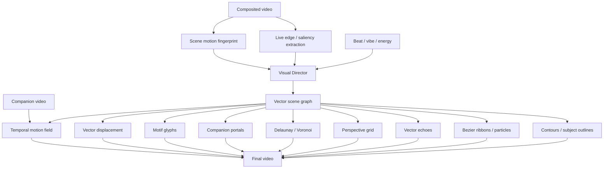

Primitive kinds:

| Kind | Function |
|---|---|
| `contours` | Sobel-derived vector-like topology from the live video frame |
| `semantic_outline` | saliency-oriented subject contour proxy with a stable semantic-outline abstraction |
| `flow_ribbons` | Bézier motion ribbons biased by indexed source motion |
| `flow_particles` | short vector trajectories moving with the same field |
| `vector_echo` | retained edge geometry from preceding frames |
| `perspective_grid` | vanishing-point geometry biased by scene motion direction |
| `delaunay_fracture` | feature-seeded triangulation; triangles can displace/reveal the actual video |
| `voronoi` | dual geometry generated from the feature-seeded Delaunay mesh |
| `portal` | animated vector masks that reveal actual companion footage |
| `motif_glyph` | deterministic recurring symbols forming a visual alphabet for musical motifs |
| `motion_transplant` | motion extracted from a companion video deforms the primary source |
| `vector_displacement` | invisible music-driven vector geometry used only as a displacement field |

The browser renderer is the reference vector implementation. It performs low-resolution
live edge extraction, deterministic geometry caching, true Bowyer-Watson-style Delaunay
construction, Voronoi dual rendering, temporal edge-history echoes, and temporal
companion-video motion transplantation.

The native renderer receives `VEC` records in its manifest and renders CPU equivalents
for contours, subject outlines, flow paths, particles, vector echoes, perspective
geometry, fracture/Voronoi geometry, motif glyphs, displacement, and companion-video
portals. It deliberately uses cheaper geometry for high-throughput final rendering while
preserving the same Visual Director decisions.

Vector effects are on by default:

```bash
tubeviz analyze song.mp3 \
  --library ./library \
  --semantic \
  --vector-effects \
  --vector-intensity 1.0 \
  --output song.timeline.json
```

Disable them:

```bash
--no-vector-effects
```

Or push them harder:

```bash
--vector-intensity 1.6
```

A strongly generative EDM cut:

```bash
tubeviz analyze song.mp3 \
  --library ./library \
  --semantic \
  --visual-match-weight 1.5 \
  --transition-weight .9 \
  --rhythm-alignment \
  --vector-effects \
  --vector-intensity 1.4 \
  --max-video-layers 4 \
  --composition-intensity 1.35 \
  --transform-intensity 1.4 \
  --novelty-weight .75 \
  --dynamic-shots \
  --reshuffle \
  --output song-vector.json
```

### Structural vector rendering

Visible vector rendering is intentionally sparse and structural.


The browser vector renderer:

- performs non-maximum-suppressed, hysteresis-connected edge extraction;
- traces connected components into whole contour paths rather than drawing one tiny line
  per edge sample;
- rejects short or noisy components using arc-length and bounding-area gates;
- simplifies paths with Ramer-Douglas-Peucker and smooths them before drawing;
- temporally matches and stabilizes contours against the previous extraction;
- stores complete paths in vector echo history rather than collections of short tangent
  marks;
- limits ordinary contour rendering to a handful of long paths;
- uses low default opacity and line density.

The native CPU renderer follows the same approach: its contour path groups strong edges
into connected components and renders ordered paths, and its flow approximation seeds
from strong image structure rather than random screen locations.

Flow ribbons use a local low-resolution block-matched motion field:

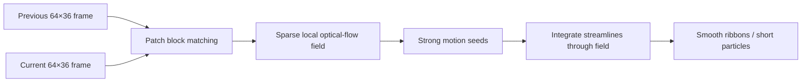

Ribbons therefore originate where the frame is actually moving and bend through local
motion, instead of trailing off as pseudo-random tendrils biased by a single global
direction.

The Visual Director also applies a visible-vector budget. Non-peak shots use at most one
visible vector family; strong peaks may use two. A deterministic share of non-peak shots
carries no visible vector geometry at all. Invisible video displacement and
motion-transplant effects can stay active, since they change the footage without covering
it in lines.

Typical family vocabulary:

| Effect family | Preferred visible vectors |
|---|---|
| `dream` | contour echo or sparse connected contours |
| `liquid` | local-flow ribbons, occasional echo/portal |
| `analog` | perspective grid or sparse contours |
| `fracture` | Delaunay fracture and, at peaks, Voronoi |
| `hyper` | local-flow ribbons and impact fracture |
| `prismatic` | companion portal and Voronoi |
| `cinematic` | salient connected outline or restrained grid |

Motif glyphs are not continuously overlaid. They are reserved for returning motif
callbacks and peak punctuation, which preserves the visual alphabet without turning it
into a persistent logo.

Timelines written by older versions of tubeviz are pruned to the current visible-vector
budget at load time, so a dense older plan does not need regenerating just to thin out
its overlay. All invisible displacement effects remain available. Regenerating the
timeline still gives cleaner shot-level choreography.

### Motion transplantation

Motion transplantation uses a secondary video as an invisible motion source:

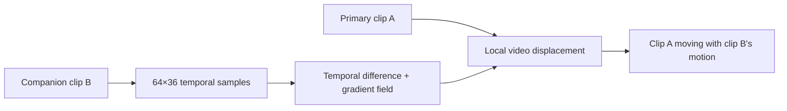

This makes effects possible such as crowd motion deforming architecture, ocean motion
deforming machinery, or a dancer's movement perturbing a city scene even when the
companion itself stays mostly hidden.

### Motif glyph memory

`motif_glyph` seeds its geometry from scene and motif identity, so recurring musical
motifs return with recognizable vector symbols whose rotation, strength, color, and
mutation evolve with the musical callback. The vector system can act as a persistent
visual alphabet rather than a stream of unrelated generative shapes.

## FFglitch codec-space effects

Codec-space effects are a separate domain from tubeviz's raster glitches, vector
geometry, and optical-flow displacement. FFglitch modifies prediction and motion-vector
structures inside a supported compressed video stream, producing true codec artifacts
that ordinary pixel filters can only imitate.

FFglitch 0.10.2 documents `ffedit` as its bitstream editor and exposes MPEG-4 Part 2
features including `mv`, `mv_delta`, and macroblock information. tubeviz never assumes
that an arbitrary downloaded H.264 or WebM clip is directly editable. It first creates a
controlled short MPEG-4 Part 2 AVI working stream, transplicates that stream with
`ffedit`, then converts the result back to a normal H.264 MP4 cache asset for the
browser and native renderers.

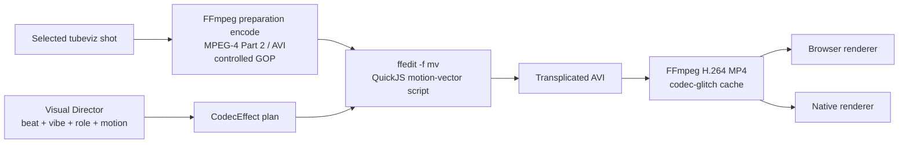

### Availability

```bash
tubeviz codec doctor
```

A healthy result looks roughly like:

```text
available: true
ffedit: /path/to/ffedit
ffedit_version: ffglitch-0.10.2 ...
ffmpeg: /usr/bin/ffmpeg
ffgac: optional
working_codec: mpeg4
```

`ffgac` is detected and reported, but materialization uses standard FFmpeg for the
controlled preparation and final conversion, and `ffedit` for the bitstream manipulation
itself.

### Scheduling codec effects

Codec effects are **opt-in** during analysis, because they land hardest when used
sparingly:

```bash
tubeviz analyze song.mp3 \
  --library ./library \
  --semantic \
  --codec-glitch musical \
  --codec-glitch-intensity .65 \
  --output song.codec-plan.json
```

Modes:

| Mode | Behavior |
|---|---|
| `off` | no codec-space effects; default |
| `subtle` | only restrained build/impact accents |
| `musical` | sparse build, mutation, fractured and payoff effects |
| `aggressive` | broader codec treatment across energetic passages |

The Visual Director schedules a compact vocabulary of true motion-vector operations:

```text
mv_drift
mv_wave
mv_shear
mv_explode
mv_implode
mv_spiral
mv_jitter
mv_freeze
mv_feedback
mv_invert
mv_radial_wave
datamosh
```

A shot is capped at one or two codec effects, so codec treatment stays a punctuation and
transition device rather than constant visual noise.

Inspect the plan before materializing:

```bash
tubeviz codec inspect song.codec-plan.json
tubeviz codec inspect song.codec-plan.json --json
```

### Parameter compatibility

FFglitch's `-sp` setup-parameter parser is not used for tubeviz's codec-effect plan. In
FFglitch 0.10.2 that parser rejects floating-point JSON values, while tubeviz effect
envelopes require fractional amounts and normalized start/end positions. tubeviz
therefore embeds the deterministic JSON-compatible effect payload directly into the
generated QuickJS source as a JavaScript object literal, preserving full precision while
still using FFglitch's documented `setup()` / `glitch_frame()` scripting path.

### Materialization

Bake scheduled codec effects into deterministic cached shot assets:

```bash
tubeviz codec materialize song.codec-plan.json \
  --library ./library \
  --output song.codec.json
```

Tuning controls:

```text
--qscale 3       MPEG-4 preparation quality
--gop 18         preparation GOP length
--fps 30         preparation frame rate
--width 1280
--height 720
--threads 0      ffedit automatic threading
--crf 18         final cached H.264 quality
--preset fast
--force          rebuild cached codec assets
```

The cache lives under:

```text
library/codec-glitch/
```

Each materialized MP4 has a JSON provenance sidecar recording the source, source range,
FFglitch version, effect plan, preparation codec/GOP/quality, and cache key. Cache keys
include source file identity, selected range, effect plan, and working/output parameters.
Final files are written atomically, so an aborted materialization is never mistaken for a
completed cache entry. The materialized timeline keeps the original source media and
range in `codec_materialization`, so `--force` regenerates from the original footage
instead of recursively glitching an already-glitched cache file.

### Rendering and previewing codec effects

Final rendering can materialize codec effects in one step:

```bash
tubeviz render song.codec-plan.json \
  --audio song.mp3 \
  --library ./library \
  --backend native \
  --codec-materialize \
  --output song-viz.mp4
```

The generated codec-materialized timeline is kept beside the output video by default,
which keeps the render reproducible.

Browser preview can materialize first as well:

```bash
tubeviz serve song.codec-plan.json \
  --audio song.mp3 \
  --library ./library \
  --codec-materialize
```

Without materialization, both renderers substitute musically equivalent raster fallbacks
for scheduled codec effects. Planning stays immediately previewable, and the genuinely
different codec artifacts are reserved for the FFglitch materialization step.

### Codec motion as a scene-selection feature

FFglitch can export motion-vector JSON, which tubeviz can use as a second
motion-analysis source alongside decoded-image temporal analysis:

```bash
tubeviz library codec-motion-index \
  --library ./library
```

Force a rebuild:

```bash
tubeviz library codec-motion-index \
  --library ./library \
  --force
```

The persisted scene fingerprint gains:

```text
codec_motion
codec_motion_peak
codec_motion_direction_x
codec_motion_direction_y
codec_motion_accents
codec_motion_frames
```

Scene matching blends codec motion with the visual-motion estimate when both are
available. Natural codec-motion peaks are also merged into beat-to-visual-accent
alignment, helping the source-offset and playback-rate search find moments where encoded
camera or object motion naturally lands on the music.

### Codec effects in Studio

Studio exposes:

```text
Codec glitch mode
Codec intensity
Materialize true FFglitch effects for browser preview
Materialize scheduled FFglitch effects before final render
FFglitch Doctor
Materialize Codec FX
Codec Motion Index
```

A productive workflow:

```text
1. codec doctor
2. optionally build Codec Motion Index once
3. Analyze with codec-glitch=musical
4. preview using raster fallbacks while editing
5. enable FFglitch materialization for a high-fidelity preview
6. final render with codec materialization enabled
```

## Previewing interactively

```bash
tubeviz serve timelines/connected.json \
  --audio audio/connected.mp3 \
  --library ./library \
  --host 127.0.0.1 \
  --port 8080
```

Open `http://127.0.0.1:8080/`.

Re-select footage from the current library without re-analyzing audio:

```bash
tubeviz serve timelines/connected.json \
  --audio audio/connected.mp3 \
  --library ./library \
  --replan-scenes \
  --semantic \
  --reshuffle
```

Recompute transforms for an existing scene plan:

```bash
tubeviz serve timelines/connected.json \
  --audio audio/connected.mp3 \
  --library ./library \
  --replan-transforms \
  --transform-intensity 1.5
```

The `serve` replan path supports the same selection controls as `analyze`: semantic
model and device, crossfade, opacity, layers, composition intensity, seed and reshuffle,
unique-clip target, novelty and cooldowns, dynamic shots, and source-excerpt limits.

Service endpoints:

| Endpoint | Purpose |
|---|---|
| `/` | Interactive visualizer |
| `/api/timeline` | Directed timeline |
| `/api/status` | Renderer/library status |
| `/audio` | Selected music |
| `/media/...` | Normalized clip media |
| `/transforms/...` | Materialized transform cache |
| `/ws` | Playback clock and visual cues |

## Rendering a final video

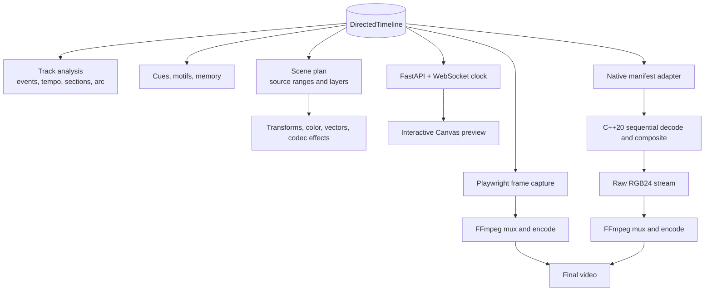

The browser path gives visual parity with the interactive Canvas renderer. The native
path avoids browser screenshots entirely: C++ decodes source video sequentially through
FFmpeg libraries, composites simultaneous layers, emits raw RGB frames, and pipes them
straight to FFmpeg for encoding.

### Optional: materialize source transforms

Materialization bakes expensive per-source transforms into reusable files while the live
renderer still handles composition and music-reactive post-processing:

```bash
tubeviz materialize timelines/connected.json \
  --library ./library \
  --width 1280 \
  --height 720 \
  --fps 30 \
  --crf 20 \
  --preset medium \
  --output timelines/connected.materialized.json
```

Use `--force` to regenerate cached transforms. Materialization is optional; the renderers
do not require it.

### Build the native renderer

The native renderer has one canonical source tree, inside the Python package, so editable
installs and built wheels compile identical renderer sources:

```text
src/tubeviz/native_src/
├── CMakeLists.txt
├── include/tubeviz/
├── src/
└── shaders/
```

Check availability:

```bash
tubeviz native doctor
```

With explicit paths:

```bash
tubeviz native doctor \
  --binary ~/.cache/tubeviz/native-build/tubeviz-native-render \
  --build-dir ~/.cache/tubeviz/native-build
```

Build:

```bash
tubeviz native build
tubeviz native build --clean
tubeviz native build --clean --jobs 16
```

For a manual CMake build:

```bash
cmake -S src/tubeviz/native_src -B build/native -DCMAKE_BUILD_TYPE=Release
cmake --build build/native -j
```

The wrapper command is normally preferable.

The native renderer uses FFmpeg/libavcodec decoding, a C++ video-effects and compositor
path, decoder caching, and OpenMP where available.

```mermaid
flowchart LR
    TL["Timeline"] --> M["Native manifest"]
    M --> D["FFmpeg/libavcodec decoders"]
    D --> C["Decoder LRU cache"]
    C --> FX["C++ video transforms"]
    FX --> COMP["Multi-source compositor"]
    COMP --> BEAT["Beat/tone-driven effects"]
    BEAT --> PIPE["Raw frames → FFmpeg encoder"]
    AUDIO["Original audio"] --> PIPE
    PIPE --> MP4["MP4"]
```

### Native backend

```bash
tubeviz render timelines/connected.json \
  --audio audio/connected.mp3 \
  --library ./library \
  --output connected-native.mp4 \
  --backend native \
  --native-build-if-missing \
  --width 1920 \
  --height 1080 \
  --fps 30 \
  --crf 20 \
  --native-preset veryfast \
  --native-decoder-cache 16 \
  --native-threads 0
```

`--native-threads 0` lets OpenMP choose available workers.

For NVIDIA hardware encoding, first check FFmpeg support:

```bash
ffmpeg -hide_banner -encoders | grep nvenc
```

Then:

```bash
tubeviz render timelines/connected.json \
  --audio audio/connected.mp3 \
  --library ./library \
  --output connected-native-nvenc.mp4 \
  --backend native \
  --video-codec h264_nvenc \
  --crf 20 \
  --native-preset fast \
  --native-decoder-cache 24 \
  --native-threads 0
```

With NVENC, tubeviz maps the quality value to FFmpeg CQ controls rather than x264-style
`-crf`.

Native-specific controls:

| Option | Purpose |
|---|---|
| `--native-binary` | Explicit native renderer executable |
| `--native-build-dir` | CMake build/cache directory |
| `--native-build-if-missing` | Build when the native executable is absent |
| `--native-keep-manifest` | Keep the generated TSV manifest |
| `--native-preset` | Native FFmpeg encoder preset |
| `--native-decoder-cache` | Decoder contexts retained across cuts |
| `--native-threads` | OpenMP effect workers; `0` = automatic |

### Browser backend

```bash
tubeviz render timelines/connected.json \
  --audio audio/connected.mp3 \
  --library ./library \
  --output connected-browser.mp4 \
  --backend browser \
  --width 1280 \
  --height 720 \
  --fps 30 \
  --crf 20 \
  --frame-format jpeg \
  --jpeg-quality 90 \
  --browser-executable /path/to/chrome
```

Other browser controls include `--browser-channel`, `--headed`, `--seed`, and
`--page-timeout`.

### Automatic backend selection

```bash
tubeviz render timelines/connected.json \
  --audio audio/connected.mp3 \
  --library ./library \
  --output connected.mp4 \
  --backend auto
```

`auto` prefers a usable native renderer and falls back to the browser path.

Common final-render controls are `--width`, `--height`, `--fps`, `--video-codec`,
`--crf`, `--preset`, `--pixel-format`, `--audio-codec`, and `--audio-bitrate`.

## Library layout

A library is persistent and can be reused even if an ingest run is interrupted.

```text
library/
├── metadata.sqlite3
├── originals/
├── normalized/
├── thumbnails/
├── metadata/
└── transforms/          # created when materialization is used
```

SQLite tracks discovery provenance, terms, status, source metadata, normalized media,
scenes, duplicate relationships, AI scores, and scene embeddings.

```mermaid
erDiagram
    CLIP ||--o{ CLIP_TERM : discovered_by
    SEARCH_TERM ||--o{ CLIP_TERM : groups
    CLIP ||--o{ SCENE : contains
    SCENE ||--o{ SCENE_EMBEDDING : represents
    SCENE ||--o| VISUAL_FEATURES : measures

    CLIP {
        int id PK
        string source_id
        string status
        string normalized_path
        float usable_start
        float usable_end
    }
    SEARCH_TERM {
        int id PK
        string term
    }
    CLIP_TERM {
        int clip_id FK
        int term_id FK
        int rank
    }
    SCENE {
        int id PK
        int clip_id FK
        float start_time
        float end_time
    }
    SCENE_EMBEDDING {
        int scene_id FK
        string model
        int dim
    }
    VISUAL_FEATURES {
        int scene_id FK
        int version
        string data_json
    }
```

### Tags and the output pool

Studio stores editable user tags and one temporary **output pool**. Tags are deliberately
separate from discovery terms: a search term records how footage entered the library,
while a tag describes how you want to organize and reuse it. Each Library card can be
tagged and independently marked for output. Studio can mark or unmark every visible ready
clip, or every ready clip carrying the selected tag.

The output pool is opt-in. With no clips marked, all ready clips stay eligible for scene
planning. As soon as one clip is marked, new `analyze` and scene-replan operations
consider only marked ready clips. **Clear pool** returns immediately to the full ready
library. Marking changes neither clip status nor media, and rejecting a marked clip
removes it from the active pool without discarding its tags.

Studio playback resolves normalized media first, then canonical duplicate media,
downloaded originals, and compatibility paths for older libraries.

## Recommended four-minute EDM workflow

For a large and varied source pool:

```bash
tubeviz ingest \
  --terms edm_search_terms.txt \
  --library ./library \
  --results-per-term 15 \
  --ai-discovery \
  --ai-query-expansion \
  --ai-candidates-per-term 150 \
  --ai-index-scenes \
  --cookies-from-browser chrome

tubeviz analyze song.mp3 \
  --library ./library \
  --semantic \
  --section-bars 8 \
  --dynamic-shots \
  --target-unique-clips 0 \
  --novelty-weight 0.75 \
  --source-excerpt-max-seconds 4 \
  --max-video-layers 3 \
  --transform-intensity 1.35 \
  --composition-intensity 1.25 \
  --reshuffle \
  --output song.timeline.json

tubeviz render song.timeline.json \
  --audio song.mp3 \
  --library ./library \
  --backend native \
  --native-build-if-missing \
  --width 1920 \
  --height 1080 \
  --fps 30 \
  --crf 20 \
  --output song-viz.mp4
```

This favors many distinct clips while using short, musically appropriate excerpts rather
than exhausting each selected source sequentially.

## Troubleshooting

### YouTube 403 / Forbidden

Use a current yt-dlp and, for content your browser can access, pass cookies:

```bash
tubeviz ingest \
  --terms search_terms.txt \
  --library ./library \
  --cookies-from-browser chrome
```

A candidate-specific failure does not invalidate the existing library; ingest continues
toward the READY quota.

### Ingest appears stuck

Use bounded download settings and `--verbose-ytdlp` when diagnosing:

```bash
tubeviz ingest \
  --terms search_terms.txt \
  --library ./library \
  --download-socket-timeout 20 \
  --download-retries 2 \
  --fragment-retries 2 \
  --verbose-ytdlp
```

### Native renderer reports an unknown new argument

The Python package and the cached native executable are different versions. Rebuild
cleanly:

```bash
tubeviz native build --clean
```

### Native render is slow

Confirm the optimized native binary is actually in use:

```bash
tubeviz native doctor
```

Then try:

```bash
tubeviz render timeline.json \
  --audio song.mp3 \
  --library ./library \
  --backend native \
  --native-preset veryfast \
  --native-decoder-cache 24 \
  --native-threads 0 \
  --fps 30 \
  --output output.mp4
```

Where available, `h264_nvenc` removes software x264 encoding from the critical path.

### Studio Play says "No media"

Studio checks actual local media availability. Inspect the record:

```bash
tubeviz library show VIDEO_ID --library ./library --json
```

A clip can exist in SQLite without a currently resolvable local media file.

### Confirming which installation is running

The Studio header shows the running version. To confirm which checkout is active:

```bash
python - <<'PY'
import tubeviz
import tubeviz.gui
print("version:", tubeviz.__version__)
print("package:", tubeviz.__file__)
print("gui:", tubeviz.gui.__file__)
PY
```

## Command reference

The CLI is the authoritative option reference:

```bash
tubeviz --help
tubeviz ingest --help
tubeviz library --help
tubeviz library list --help
tubeviz library show --help
tubeviz library reject --help
tubeviz library restore --help
tubeviz library delete --help
tubeviz library stats --help
tubeviz library ai-report --help
tubeviz library visual-index --help
tubeviz library codec-motion-index --help
tubeviz library embed --help
tubeviz analyze --help
tubeviz materialize --help
tubeviz render --help
tubeviz codec doctor --help
tubeviz audio-ai doctor --help
tubeviz audio-ai inspect --help
tubeviz codec inspect --help
tubeviz codec materialize --help
tubeviz native build --help
tubeviz native doctor --help
tubeviz gui --help
tubeviz serve --help
```

Top-level commands:

| Command | Purpose |
|---|---|
| `tubeviz ingest` | Search, download, normalize, scene-index and optionally AI-rank footage |
| `tubeviz ingest-url` | Import explicit YouTube URLs through the complete scene-understanding pipeline |
| `tubeviz library` | Inspect, curate, delete, report on and embed the persistent library |
| `tubeviz analyze` | Analyze music and produce the directed timeline |
| `tubeviz choreography` | Inspect stored phrase trajectories and the whole-song visual arc |
| `tubeviz music-ai` | Diagnose optional MERT music-representation support |
| `tubeviz materialize` | Bake selected source transforms into cached media |
| `tubeviz render` | Render final video with the native, browser or auto backend |
| `tubeviz codec` | Inspect, materialize and diagnose FFglitch codec-space effects |
| `tubeviz audio-ai` | Diagnose and inspect CLAP/AI choreography metadata |
| `tubeviz native` | Build or diagnose the native renderer |
| `tubeviz gui` | Launch Studio |
| `tubeviz serve` | Run the interactive visualizer/preview server |

## Development

Run tests:

```bash
pytest -q
```

JavaScript syntax checks:

```bash
node --check src/tubeviz/static/visualizer.js
node --check src/tubeviz/static/gui.js
```

Native build diagnostics:

```bash
tubeviz native doctor
```

Release history is maintained in [CHANGELOG.md](CHANGELOG.md).

## License

tubeviz is licensed under the **Apache License, Version 2.0**. See [LICENSE](LICENSE) for
the complete license text and [NOTICE](NOTICE) for project notices. Source files use the
SPDX identifier:

```text
SPDX-License-Identifier: Apache-2.0
```

### Third-party software, models, and media

The Apache-2.0 license applies to the **tubeviz software itself**. It does not grant
rights to third-party videos, audio, model weights, downloaded media, or external tools
used with tubeviz. FFmpeg, yt-dlp, FFglitch, OpenCLIP, CLAP/Transformers models, PyTorch,
Playwright/Chromium, and other dependencies retain their own licenses and terms. tubeviz
does not redistribute FFglitch binaries.

You are responsible for ensuring that media you download, import, transform, or
distribute with tubeviz is used consistently with applicable copyright law, licenses,
platform terms, and other requirements.
