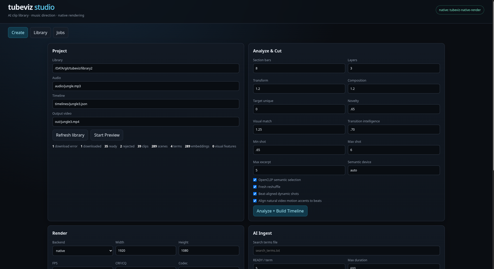

# tubeviz

## v0.29 acquisition quality

Theme-first discovery now uses a quality-over-quantity preview gate. Candidate regions are measured with optical flow, temporal diversity, text-region occupancy/persistence, face dominance, and an exposure/sharpness/color aesthetic heuristic. These are hard gates: semantic similarity cannot rescue a static, caption-heavy, presenter-dominated probe. Long sources remain eligible; Tubeviz probes eight stratified randomized regions by default and downloads only a 45-second yt-dlp time range around the strongest passing region.

Useful controls include `--max-text-overlay-fraction`, `--max-persistent-text-fraction`, `--min-motion-coverage`, `--min-temporal-diversity`, `--max-face-dominance`, `--min-aesthetic-score`, `--long-video-segment-attempts`, and `--long-video-excerpt-seconds`. Studio exposes the same controls.


## v0.28.2: stronger dynamic-footage gating and long-source sampling

Search ingestion now treats **dynamicness as a hard acceptance gate**, not merely one component of semantic fitness. A thematically relevant but nearly static source is rejected when its best sampled window does not meet `--min-dynamic-score` (default `0.24`).

Long finite YouTube results are no longer automatically discarded just because the source duration exceeds `--hard-max-duration`. With `--sample-long-videos` enabled (the default), Tubeviz probes randomized time windows across the source, scores them for music-video fitness/dynamicness, chooses the strongest region, and uses yt-dlp range downloading to ingest only a bounded segment. `--hard-max-duration` therefore acts as the maximum downloaded clip/segment duration for automatic discovery.

```bash
tubeviz ingest \
  --visual-brief 'euphoric nocturnal electronic energy, kinetic city movement and club silhouettes' \
  --library ./library \
  --preview-gate \
  --min-video-fitness 0.18 \
  --min-dynamic-score 0.24 \
  --hard-max-duration 600 \
  --sample-long-videos \
  --long-video-segment-attempts 4
```

For a 45-minute candidate with a 600-second maximum, Tubeviz can sample multiple randomized windows and download a selected 10-minute range instead of rejecting all 45-minute sources. Use `--no-sample-long-videos` to restore strict source-duration rejection.


**tubeviz** is an AI-directed, video-first music visualizer. It builds a persistent local clip library from search concepts, analyzes music for rhythm/tempo/structure/vibe, selects short source excerpts intelligently, plans beat-aligned edits and transforms, previews them interactively, and renders the result through either the native C++/FFmpeg backend or the browser renderer.

Current version: **0.28.1**

## Sample videos

These are complete videos produced with tubeviz:

- [Tubeviz — Andrew Bayer feat. Alison May — Open End Resource (OCULA Remix)](https://youtu.be/8eqdMmgcG_4)
- [Tubeviz — Step It Up — Stereo MC's](https://youtu.be/nrYzxJzPYbE)


## What’s new in 0.28.x

### 0.28.1 acquisition-planner reliability fixes

- Visual briefs are never sent to YouTube as paragraph-sized search strings. Both LLM and deterministic planner output are normalized into short, searchable queries.
- Negative guidance such as “avoid text/logos/talking heads” remains in OpenCLIP rejection scoring instead of contaminating YouTube search syntax.
- `--acquisition-query-count` is honored by filling LLM shortfalls with diverse deterministic queries.
- Studio exposes the acquisition planner LLM endpoint/model/key in the normal AI Ingest workflow.
- Studio displays its runtime version from `tubeviz.__version__`; the stale hard-coded v0.27 label is removed.


v0.28 adds theme-first, audio-informed, library-aware AI footage acquisition with progressive metadata/thumbnail/preview gates, music-video fitness scoring, and automatic weak intro/outro trimming. The v0.27 choreography intelligence remains fully included.

## Choreography intelligence introduced in 0.27.0

v0.27 makes scene choice and effects **phrase-aware** rather than merely reactive to the current beat/section:

- **Build/drop/release trajectory model:** every musical section now carries tension, tension slope, build/drop/release probabilities, anticipation, time-to-peak, pre-drop withholding, and continuous targets for motion, complexity, contrast, and edit density.
- **Multi-shot beam-search planning:** the scene selector evaluates short future shot sequences (five shots by default) instead of greedily choosing every shot in isolation. Sequence scoring combines semantics, CLAP↔OpenCLIP alignment, motion/complexity trajectory, transition progression, source reuse, and novelty.
- **Anticipation and payoff:** builds ramp nonlinearly toward future peaks; the last portion of a strong build can deliberately simplify/withhold effects before the impact, while drops get stronger contrast, transform, vector, bloom and codec treatment.
- **Effect/footage compatibility:** source scenes are scored for whether their natural motion, complexity, entropy and internal cut rate are suitable for the intended `dream`, `liquid`, `analog`, `fracture`, `hyper`, `prismatic`, or `cinematic` treatment.
- **Whole-song visual arc:** trajectory metadata is persisted in the timeline and supplied to the optional LLM director so higher-level treatment plans can reason about future escalation and release without owning exact clip IDs or cut times.
- **Optional MERT music representations:** `--music-ai` uses `m-a-p/MERT-v1-95M` to measure music-specific embedding novelty/velocity between windows. These structural signals reinforce transitions and drop detection without pretending MERT is a text-semantic model.
- **Preference learning from curation:** after enough manual rejects exist, tubeviz builds a soft negative visual-feature profile and gently avoids scenes resembling repeatedly rejected footage. It is a weighted ranking signal, not a blacklist.
- **Safer `auto` AI devices:** CLAP, OpenCLIP and MERT now verify that the installed PyTorch wheel actually contains kernels for the detected CUDA compute capability. Unsupported GPUs automatically fall back to CPU instead of crashing with `no kernel image is available for execution on the device`. Explicit unsupported `cuda` requests fail early with a useful diagnostic.
- **Studio controls:** trajectory strength, anticipation horizon, lookahead depth, beam width, effect compatibility, preference learning and optional MERT are available in the curated Analyze panel and through Command Center.
- **Choreography inspection:** `tubeviz choreography inspect timeline.json` shows the build/drop/release decisions stored in a timeline.


## Manually add a YouTube clip

When you already know the exact source footage you want, bypass search and AI discovery:

```bash
tubeviz ingest-url \
  'https://www.youtube.com/watch?v=VIDEO_ID' \
  --library ./library
```

Multiple URLs can be imported in one invocation:

```bash
tubeviz ingest-url URL1 URL2 URL3 --library ./library --term hand-picked
```

Manual URL ingestion runs the full tubeviz scene-understanding pipeline by default: yt-dlp metadata extraction, duplicate detection, download, FFmpeg normalization, scene detection, thumbnails, decoded temporal visual-feature indexing, OpenCLIP scene embeddings, and zero-shot semantic classification. Scene labels include useful visual concepts such as crowd, dancing, nightlife, city, tunnel, transport, industrial, architecture, abstract, lights, moving POV, macro, fire/smoke, plus negative classes such as text-heavy, talking-head, and static-presentation. It accepts the same browser-cookie and network controls needed for accessible YouTube content:

```bash
tubeviz ingest-url 'https://youtu.be/VIDEO_ID' \
  --library ./library \
  --term head-at-curated \
  --cookies-from-browser chrome \
  --scene-threshold 0.40 \
  --min-scene-seconds 1.5
```

The manual command deliberately defaults `--hard-max-duration` to `0` (disabled), because an explicitly selected source should not be rejected merely because it is longer than the normal discovery policy. Use `--hard-max-duration` when you do want that guardrail. `--force` reprocesses an existing clip.

## Architecture

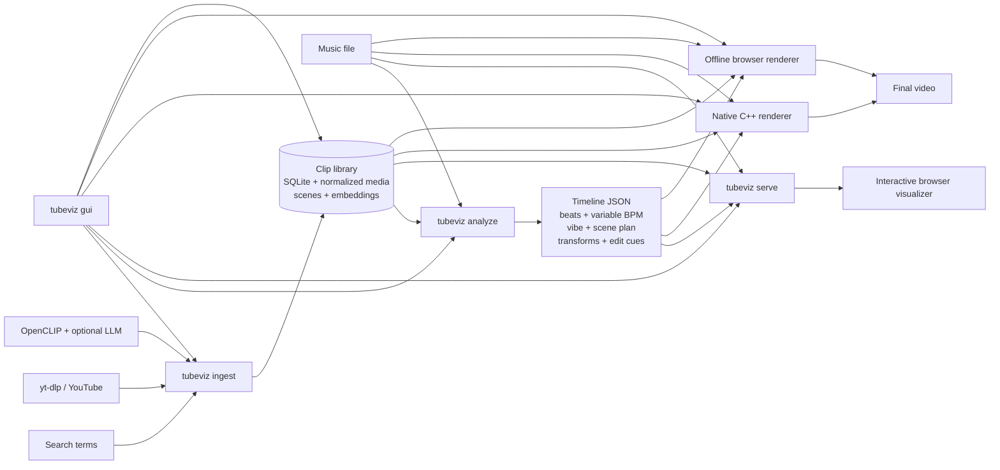

### Music-to-video direction

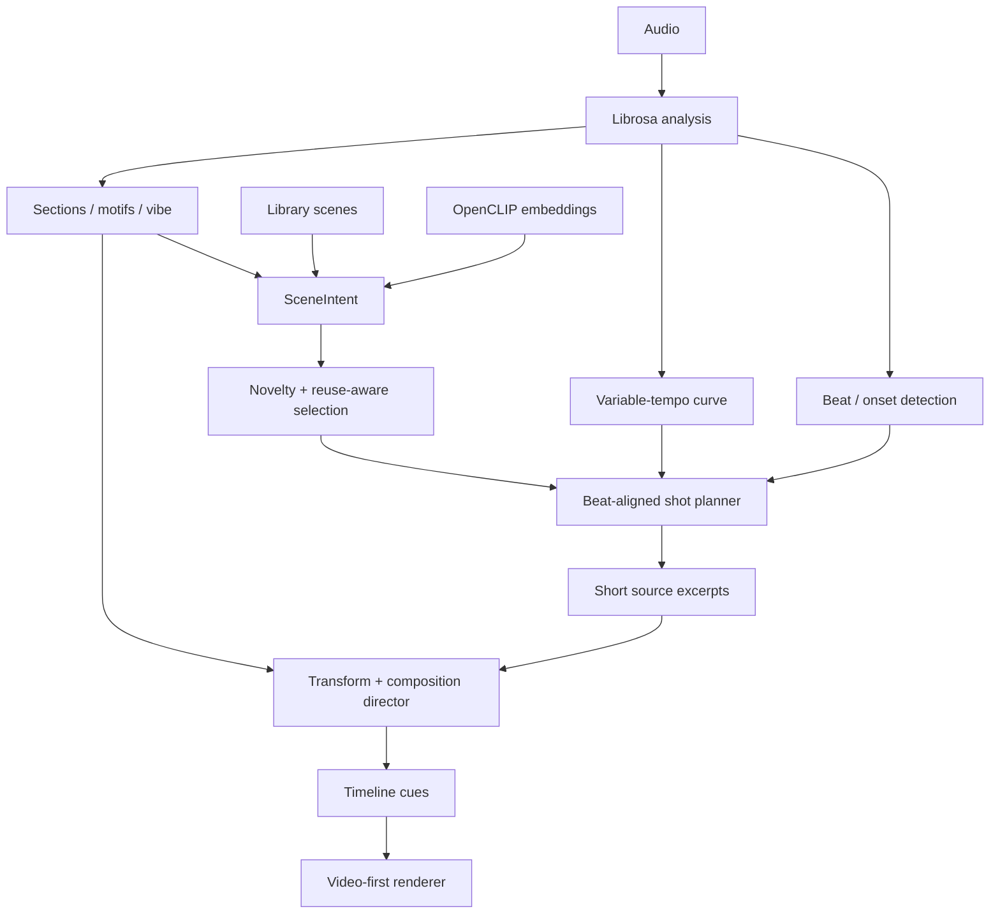

## Requirements

- Python **3.11+**
- FFmpeg / ffprobe
- yt-dlp is installed by the Python package
- Chrome/Chromium + Playwright only for the browser/offline-browser renderer
- CMake, a C++20 compiler, pkg-config, and FFmpeg development libraries for the native renderer
- OpenCLIP dependencies only when semantic/AI visual selection is wanted
- FFglitch **0.10.2** `ffedit` only for true codec-space motion-vector effects; `fflive` and `ffgac` are optional and not required by tubeviz

System packages used by the full feature set:

**Arch Linux / CachyOS:**

```bash
sudo pacman -S --needed \
  base-devel cmake pkgconf ffmpeg curl unzip chromium
```

**Debian / Ubuntu:**

```bash
sudo apt install \
  build-essential cmake pkg-config ffmpeg curl unzip chromium \
  libavformat-dev libavcodec-dev libavutil-dev libswscale-dev
```

`chromium` is only required when you want browser preview/offline browser
rendering and do not use Playwright's downloaded browser. CMake/compiler and
FFmpeg development headers are only required to build the native C++ renderer.
FFglitch is installed separately below because it is not normally provided by
tubeviz or Python packaging.

Install the base project:

```bash
git clone <repo-url> tubeviz
cd tubeviz
python -m venv .venv
source .venv/bin/activate
pip install -e .
```

For development, semantic selection, AI ingest, and browser rendering:

```bash
pip install -e '.[dev,semantic,render]'
```

If using Playwright's Chromium:

```bash
playwright install chromium
```

Verify:

```bash
tubeviz --help
ffmpeg -version
```

#### Codec-cache filesystems and MP4 faststart

Codec-glitch shots are finalized in tubeviz's local temporary directory and only then published to `library/codec-glitch/`. This avoids FFmpeg's `+faststart` in-place MP4 rewrite running directly on NFS, FUSE, network, merger, or other mounted library filesystems. If the optional faststart pass still fails locally, tubeviz retries without faststart; cached shots do not require a front-loaded `moov` atom. Cache publication uses a same-directory temporary file plus `fsync` and atomic `os.replace`, so interrupted materialization cannot expose a partially written MP4.

## FFglitch installation

FFglitch is **not** a Python dependency and is not installed by `pip`. tubeviz
uses the external `ffedit` executable for true codec-space motion-vector
materialization. The supported/recommended release is **FFglitch 0.10.2**.
FFglitch's official documentation identifies `ffedit` as the main multimedia
bitstream editor; `fflive` is for live playback/glitching and `ffgac` is an
FFmpeg variant with extra glitch-oriented functionality. tubeviz only requires
`ffedit`.

#### Linux x86-64

The official prebuilt archive is:

```text
https://ffglitch.org/pub/bin/linux64/ffglitch-0.10.2-linux-x86_64.zip
```

A user-local installation that does not modify `/usr/local`:

```bash
mkdir -p ~/.local/bin
tmpdir="$(mktemp -d)"
curl -L \
  https://ffglitch.org/pub/bin/linux64/ffglitch-0.10.2-linux-x86_64.zip \
  -o "$tmpdir/ffglitch.zip"
unzip -q "$tmpdir/ffglitch.zip" -d "$tmpdir/unpacked"
install -m 0755 \
  "$(find "$tmpdir/unpacked" -type f -name ffedit -print -quit)" \
  ~/.local/bin/ffedit
rm -rf "$tmpdir"

# Ensure ~/.local/bin is on PATH for this shell/session.
export PATH="$HOME/.local/bin:$PATH"

ffedit -h | head -40
tubeviz codec doctor
```

If you also want FFglitch's optional tools, locate them in the same extracted
archive and install them similarly:

```bash
# Optional; tubeviz does not require these.
install -m 0755 "$(find /path/to/extracted-ffglitch -type f -name fflive -print -quit)" ~/.local/bin/fflive
install -m 0755 "$(find /path/to/extracted-ffglitch -type f -name ffgac -print -quit)" ~/.local/bin/ffgac
```

#### Linux aarch64

FFglitch also publishes an official Linux aarch64 archive:

```text
https://ffglitch.org/pub/bin/linux-aarch64/ffglitch-0.10.2-linux-aarch64.7z
```

Extract it with `7z`, copy `ffedit` to a directory on `PATH`, and verify with
`tubeviz codec doctor`.

#### macOS and Windows

Official FFglitch 0.10.2 archives are also published for macOS x86-64, macOS
aarch64/Apple silicon, and Windows x86-64. Install `ffedit` from the appropriate
archive and ensure the executable is on `PATH` before starting tubeviz. See the
FFglitch Download page for the current official archive links.

#### What tubeviz does with FFglitch

tubeviz does **not** send arbitrary YouTube/H.264/WebM files directly to
`ffedit`. FFglitch features are codec-specific. tubeviz first prepares a short,
controlled MPEG-4 Part 2 working asset, runs scripted `ffedit` motion-vector
transplication, and then converts the result back to an ordinary cached MP4.
This is why both ordinary FFmpeg **and** FFglitch `ffedit` are required for true
codec effects.


Useful diagnostics:

```bash
command -v ffedit
ffedit -h | head -40
tubeviz codec doctor
```

If `tubeviz codec doctor` reports that FFglitch is unavailable, ordinary
analysis, preview, vector effects, and rendering still work; only true
FFglitch materialization is unavailable.

## Studio contextual help

Studio provides inline `?` help affordances for form controls. Hover or focus a help icon to see tubeviz-specific guidance; controls in the Advanced Command Center use the current CLI parser help, defaults, and choices so GUI help stays synchronized with the command line. Since 0.26.10, help bubbles are rendered in a document-level floating layer (`position: fixed`) with viewport clamping and automatic above/below placement, so panel overflow and scrolling cannot crop them. Press **Escape** to dismiss a focused tooltip.

The Manual YouTube URL workflow uses a dedicated multi-line URL editor with one source URL per line and keeps uncommon network/normalization settings under **Advanced ingest settings**.

For Hugging Face authentication, leave the Studio token field blank to inherit a server-side `HF_TOKEN`. For security, the value of an environment token is never sent to the browser. The **Show typed token** control only reveals a token entered directly into that Studio field.

## Quick start: Studio GUI

The easiest way to operate the current system is Studio:

```bash
tubeviz gui \
  --project-root /DATA/git/tubeviz \
  --library /DATA/git/tubeviz/library
```

It opens `http://127.0.0.1:8090/` by default.

The Studio header displays the running tubeviz version. Studio HTML, CSS, and JavaScript are served with cache-busting/no-cache behavior, so after upgrading and restarting the Studio process the browser should immediately show the new assets. To verify which checkout is running:

```bash
python - <<'PY'
import tubeviz
import tubeviz.gui
print("version:", tubeviz.__version__)
print("package:", tubeviz.__file__)
print("gui:", tubeviz.gui.__file__)
PY
```

For this release, the header and `tubeviz.__version__` should report **0.28.1**.

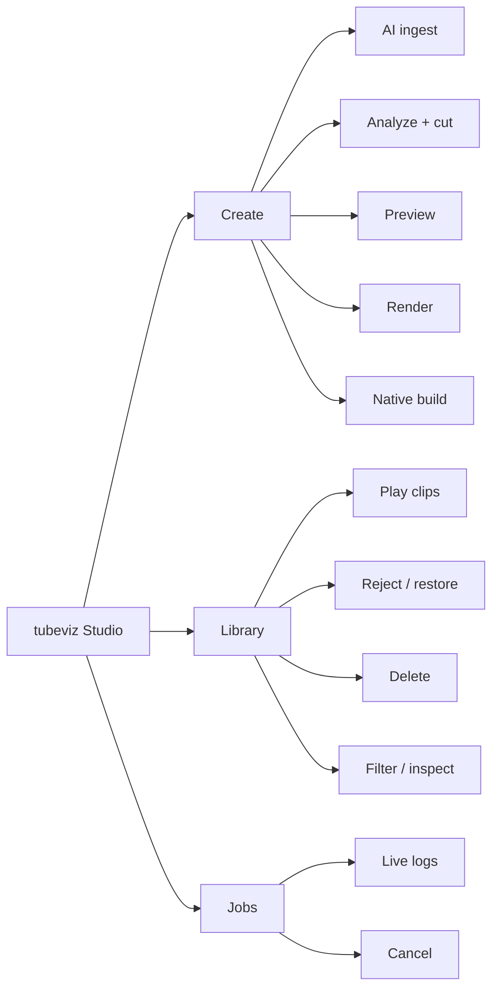

Other GUI options:

```bash
tubeviz gui --library ./library --port 8095
tubeviz gui --library ./library --no-open
tubeviz gui --host 0.0.0.0 --port 8090
```

The GUI runs the same CLI workflows described below; it is not a separate rendering implementation.


## Studio GUI parity and manual URL ingestion

Studio now has two complementary interfaces:

1. the curated **Create** and **Library** panels for frequent workflows; and
2. the generated **Command Center**, which reflects the current `argparse`
   command tree and exposes every non-GUI CLI leaf command and option.

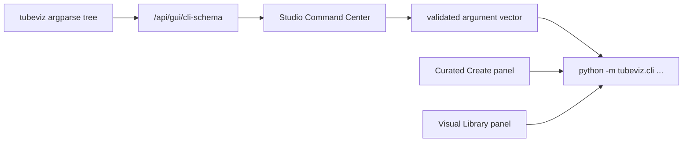

The Command Center is deliberately generated from the parser rather than from a
second hand-maintained option list. If an option is added to commands such as
`analyze`, `render`, `serve`, `codec materialize`, `library embed`, or
`ingest`, it appears in Studio automatically. Commands are launched as argument
vectors without shell interpolation.

Current generated command coverage includes:

```text
tubeviz ingest
tubeviz ingest-url
tubeviz library list
tubeviz library show
tubeviz library reject
tubeviz library restore
tubeviz library delete
tubeviz library stats
tubeviz library ai-report
tubeviz library visual-index
tubeviz library codec-motion-index
tubeviz library embed
tubeviz audio-ai doctor
tubeviz audio-ai inspect
tubeviz analyze
tubeviz materialize
tubeviz render
tubeviz codec doctor
tubeviz codec inspect
tubeviz codec materialize
tubeviz native build
tubeviz native doctor
tubeviz serve
```

The `tubeviz gui` command itself is intentionally not recursively launchable
from Command Center because the current Studio process already owns the GUI.

### Manual URL ingestion in Studio

The Create panel includes **Manual YouTube URL Ingest**. Paste one or more URLs,
one per line, and optionally assign a provenance term such as `hand-picked`,
`head-at-curated`, or `industrial-favorites`.

The visual form exposes the complete `ingest-url` workflow:

```text
provenance term
minimum / hard maximum duration
minimum source width
normalization width / height / FPS
scene-change threshold
minimum scene duration
browser cookies
network timeout
fragment concurrency and retries
keep audio
skip scene detection
skip temporal visual indexing
OpenCLIP semantic device / model / weights
skip semantic embeddings
skip automatic scene classification
force reprocessing
verbose yt-dlp
```

The resulting clips enter the exact same persistent library pipeline as searched
clips: metadata, duplicate checks, download, normalization, scene indexing,
thumbnails, visual fingerprints, trimming, semantic embeddings, and later
selection are all shared.

### Using project paths in Command Center

Select any command and click **Use current Project paths** to copy the Studio
Library, Audio, Timeline, Output, and Search Terms fields into matching CLI
arguments. The argument-vector preview shows the exact command before it is
launched. Long-running advanced commands use the same cancellable Studio job
manager and live log system as the curated controls.


## End-to-end CLI workflow

### 1. Create search concepts

`search_terms.txt` contains one visual concept per line:

```text
underground techno warehouse strobe
laser tunnel rave crowd
analog CRT glitch surveillance
industrial machinery sparks
cyberpunk city rain neon
abstract liquid chrome macro
satellite earth night timelapse
high speed train tunnel POV
```

### 2. Ingest a clip library

Basic ingest:

```bash
tubeviz ingest \
  --terms search_terms.txt \
  --library ./library \
  --results-per-term 10 \
  --cookies-from-browser chrome
```

AI-assisted ingest:

```bash
tubeviz ingest \
  --terms search_terms.txt \
  --library ./library \
  --results-per-term 10 \
  --cookies-from-browser chrome \
  --ai-discovery \
  --ai-query-expansion \
  --ai-query-count 8 \
  --ai-candidates-per-term 100 \
  --ai-device auto \
  --ai-index-scenes
```

A more permissive source-duration configuration:

```bash
tubeviz ingest \
  --terms search_terms.txt \
  --library ./library \
  --results-per-term 10 \
  --search-pool 50 \
  --max-search-pool 500 \
  --search-pool-step 50 \
  --preferred-max-duration 1200 \
  --hard-max-duration 0 \
  --scene-threshold 0.40 \
  --min-scene-seconds 1.5 \
  --download-socket-timeout 20 \
  --concurrent-fragments 4 \
  --download-retries 2 \
  --fragment-retries 2 \
  --cookies-from-browser chrome
```

Important ingest controls:

| Option | Purpose |
|---|---|
| `--results-per-term N` | Desired READY clips per seed term |
| `--search-pool N` | Initial search result window |
| `--max-search-pool N` | Maximum progressively expanded search window |
| `--search-pool-step N` | Expansion step when the READY quota is not filled |
| `--min-duration S` | Reject clips shorter than this |
| `--preferred-max-duration S` | Soft preference for shorter videos; `0` disables |
| `--hard-max-duration S` | Hard rejection limit; `0` disables |
| `--min-width PX` | Reject narrow video; `0` disables |
| `--width/--height/--fps` | Normalized media format |
| `--scene-threshold` | FFmpeg scene-change sensitivity |
| `--min-scene-seconds` | Minimum indexed scene duration |
| `--keep-audio` | Retain AAC audio in normalized clips |
| `--no-scenes` | Skip scene detection/thumbnails |
| `--force` | Reprocess already-ready clips |
| `--cookies-from-browser BROWSER` | Use browser cookies through yt-dlp |
| `--ai-discovery` | Rank candidates visually before downloading |
| `--ai-query-expansion` | Expand seed concepts into diverse searches |
| `--ai-query-count N` | Number of expanded searches |
| `--ai-candidates-per-term N` | Candidate pool scored before download |
| `--ai-model/--ai-pretrained` | OpenCLIP configuration |
| `--ai-device auto|cpu|cuda...` | AI execution device |
| `--ai-diversity-weight` | Penalize visually redundant candidates |
| `--ai-near-duplicate-threshold` | Similarity threshold for near duplicates |
| `--ai-negative-weight` | Strength of undesirable-content penalty |
| `--ai-metadata-weight` | Metadata contribution to ranking |
| `--ai-min-score` | Reject AI candidates below score |
| `--ai-negative-concepts` | Comma-separated concepts to penalize |
| `--ai-llm-base-url/--ai-llm-model` | Optional OpenAI-compatible query-expansion model |
| `--ai-index-scenes` | Embed detected scenes while AI model is loaded |
| `--verbose-ytdlp` | Expose detailed yt-dlp diagnostics |

Active/upcoming/post-live streams are rejected. Archived finite VODs remain usable when yt-dlp exposes suitable media.

### 3. Inspect and curate the library

```bash
tubeviz library stats --library ./library
tubeviz library list --library ./library --limit 50
tubeviz library list --library ./library --status ready --term "warehouse"
tubeviz library list --library ./library --json
tubeviz library show VIDEO_ID --library ./library
tubeviz library show VIDEO_ID --library ./library --json
```

Reject without deleting:

```bash
tubeviz library reject VIDEO_ID \
  --library ./library \
  --reason "static talking-head footage"
```

Restore:

```bash
tubeviz library restore VIDEO_ID --library ./library
```

Preview a destructive deletion first:

```bash
tubeviz library delete VIDEO_ID --library ./library --dry-run
```

Delete it:

```bash
tubeviz library delete VIDEO_ID --library ./library
```

Delete without confirmation:

```bash
tubeviz library delete VIDEO_ID --library ./library --yes
```

Keep the downloaded original while removing tracked derived assets/metadata:

```bash
tubeviz library delete VIDEO_ID --library ./library --keep-original
```

Inspect persisted AI ranking:

```bash
tubeviz library ai-report --library ./library --limit 50
tubeviz library ai-report --library ./library --term "laser tunnel" --limit 25
```

Embed existing scene thumbnails:

```bash
tubeviz library embed --library ./library --device auto
```

Force regeneration:

```bash
tubeviz library embed \
  --library ./library \
  --model ViT-B-32 \
  --pretrained laion2b_s34b_b79k \
  --device cuda \
  --batch-size 64 \
  --force
```

### 4. Analyze music and build the edit

Recommended current workflow:

```bash
tubeviz analyze audio/connected.mp3 \
  --library ./library \
  --semantic \
  --semantic-device auto \
  --section-bars 8 \
  --max-video-layers 3 \
  --composition-intensity 1.2 \
  --transform-intensity 1.2 \
  --dynamic-shots \
  --min-shot-seconds 0.65 \
  --max-shot-seconds 6 \
  --source-excerpt-max-seconds 5 \
  --target-unique-clips 0 \
  --novelty-weight 0.65 \
  --reshuffle \
  --output timelines/connected.json
```

`--target-unique-clips 0` automatically scales the desired source diversity to track duration and available library size. A selected indexed scene does **not** have to play in full: `--source-excerpt-max-seconds` caps the source interval used for an individual visual shot.

For a reproducible alternate cut:

```bash
tubeviz analyze audio/connected.mp3 \
  --library ./library \
  --semantic \
  --selection-seed 48151623 \
  --selection-variation 0.30 \
  --output timelines/connected-seed.json
```

For another randomized cut:

```bash
tubeviz analyze audio/connected.mp3 \
  --library ./library \
  --semantic \
  --reshuffle \
  --output timelines/connected-alt.json
```

Key analysis groups:

| Controls | Options |
|---|---|
| Audio analysis | `--sample-rate`, `--hop-length`, `--beats-per-bar` |
| Musical sections | `--section-bars`, `--section-seconds` |
| Variable BPM | `--tempo-window-seconds`, `--tempo-smoothing-seconds`, `--tempo-curve-seconds`, `--tempo-change-bpm`, `--min-tempo`, `--max-tempo`, `--tempo-octave-min`, `--tempo-octave-max` |
| Scene selection | `--library`, `--scene-crossfade`, `--clip-opacity`, `--min-play-scene-seconds` |
| Semantic retrieval | `--semantic`, `--semantic-model`, `--semantic-pretrained`, `--semantic-device` |
| Effects | `--no-transforms`, `--transform-intensity`, `--max-video-layers`, `--composition-intensity` |
| Alternate cuts | `--selection-seed`, `--selection-variation`, `--reshuffle` |
| Diversity | `--target-unique-clips`, `--novelty-weight`, `--novelty-candidate-fraction`, `--clip-reuse-cooldown`, `--scene-reuse-cooldown` |
| Dynamic editing | `--dynamic-shots`, `--min-shot-seconds`, `--max-shot-seconds`, `--source-excerpt-max-seconds` |
| Vector direction | `--vector-effects`, `--vector-intensity` |

### Variable-BPM and vibe analysis

Long mixes are not treated as a single immutable BPM. Analysis persists a local tempo curve and emits tempo-change events after sufficiently large local shifts. Musical direction also uses section energy, brightness, onset density, spectral/timbral information, motif recurrence, and structural position to drive scene intent, edit density, composition, and transform intensity.

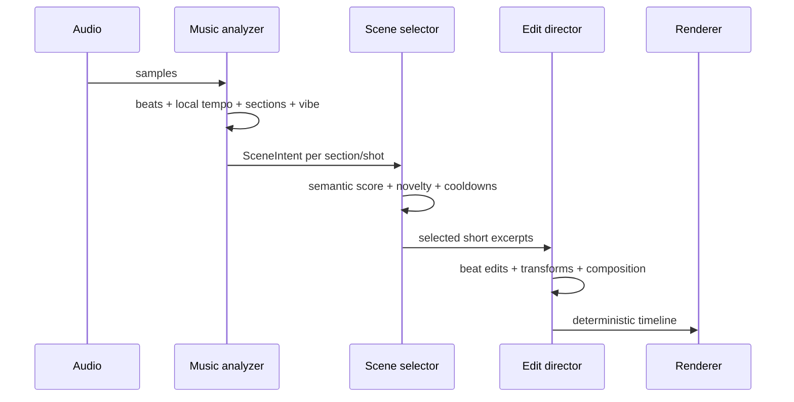

### 5. Preview interactively

```bash
tubeviz serve timelines/connected.json \
  --audio audio/connected.mp3 \
  --library ./library \
  --host 127.0.0.1 \
  --port 8080
```

Open `http://127.0.0.1:8080/`.

Re-select footage from the current library without re-analyzing audio:

```bash
tubeviz serve timelines/connected.json \
  --audio audio/connected.mp3 \
  --library ./library \
  --replan-scenes \
  --semantic \
  --reshuffle
```

Recompute transforms for an existing scene plan:

```bash
tubeviz serve timelines/connected.json \
  --audio audio/connected.mp3 \
  --library ./library \
  --replan-transforms \
  --transform-intensity 1.5
```

The `serve` replan path supports the same selection controls used by `analyze`: semantic model/device, crossfade, opacity, layers, composition intensity, seed/reshuffle, unique-clip target, novelty/cooldowns, dynamic shots, and source-excerpt limits.

Browser service endpoints:

| Endpoint | Purpose |
|---|---|
| `/` | Interactive visualizer |
| `/api/timeline` | Directed timeline |
| `/api/status` | Renderer/library status |
| `/audio` | Selected music |
| `/media/...` | Normalized clip media |
| `/transforms/...` | Materialized transform cache |
| `/ws` | Playback clock and visual cues |

### 6. Optional: materialize source transforms

Materialization bakes expensive per-source transforms into reusable files while the live renderer can still perform composition and music-reactive post-processing:

```bash
tubeviz materialize timelines/connected.json \
  --library ./library \
  --width 1280 \
  --height 720 \
  --fps 30 \
  --crf 20 \
  --preset medium \
  --output timelines/connected.materialized.json
```

Use `--force` to regenerate cached transforms.

Materialization is optional; the current renderers do not require it for all effects.

### Native source layout

The native renderer has **one canonical source tree**:

```text
src/tubeviz/native_src/
├── CMakeLists.txt
├── include/tubeviz/
├── src/
└── shaders/
```

Older tubeviz source archives contained an identical second copy at top-level
`native/`. That duplication has been removed. Keeping the canonical C++ source
inside the Python package means editable installs and built wheels compile the
exact same renderer sources, eliminating drift between checkout and packaged
code.

Manual CMake builds now use:

```bash
cmake -S src/tubeviz/native_src -B build/native -DCMAKE_BUILD_TYPE=Release
cmake --build build/native -j
```

Normally prefer the wrapper command:

```bash
tubeviz native build --clean
```

### 7. Build and inspect the native renderer

Inspect availability:

```bash
tubeviz native doctor
```

With explicit paths:

```bash
tubeviz native doctor \
  --binary ~/.cache/tubeviz/native-build/tubeviz-native-render \
  --build-dir ~/.cache/tubeviz/native-build
```

Build:

```bash
tubeviz native build
```

Clean rebuild:

```bash
tubeviz native build --clean
```

Parallel build:

```bash
tubeviz native build --clean --jobs 16
```

The native renderer uses FFmpeg/libavcodec decoding, a C++ video-effects/compositor path, decoder caching, and OpenMP where available.

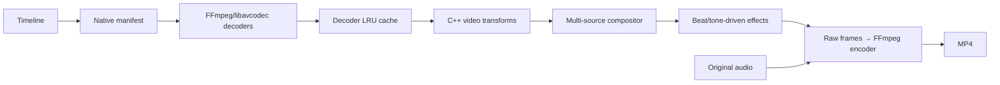

### 8. Render a final video

#### Native backend

```bash
tubeviz render timelines/connected.json \
  --audio audio/connected.mp3 \
  --library ./library \
  --output connected-native.mp4 \
  --backend native \
  --native-build-if-missing \
  --width 1920 \
  --height 1080 \
  --fps 30 \
  --crf 20 \
  --native-preset veryfast \
  --native-decoder-cache 16 \
  --native-threads 0
```

`--native-threads 0` lets OpenMP choose available workers.

For NVIDIA hardware encoding, first verify FFmpeg support:

```bash
ffmpeg -hide_banner -encoders | grep nvenc
```

Then:

```bash
tubeviz render timelines/connected.json \
  --audio audio/connected.mp3 \
  --library ./library \
  --output connected-native-nvenc.mp4 \
  --backend native \
  --video-codec h264_nvenc \
  --crf 20 \
  --native-preset fast \
  --native-decoder-cache 24 \
  --native-threads 0
```

For NVENC, tubeviz maps the quality value to FFmpeg CQ controls rather than x264-style `-crf`.

Native-specific controls:

| Option | Purpose |
|---|---|
| `--native-binary` | Explicit native renderer executable |
| `--native-build-dir` | CMake build/cache directory |
| `--native-build-if-missing` | Build when native executable is absent |
| `--native-keep-manifest` | Keep generated TSV manifest |
| `--native-preset` | Native FFmpeg encoder preset |
| `--native-decoder-cache` | Decoder contexts retained across cuts |
| `--native-threads` | OpenMP effect workers; `0` = automatic |

#### Browser backend

```bash
tubeviz render timelines/connected.json \
  --audio audio/connected.mp3 \
  --library ./library \
  --output connected-browser.mp4 \
  --backend browser \
  --width 1280 \
  --height 720 \
  --fps 30 \
  --crf 20 \
  --frame-format jpeg \
  --jpeg-quality 90 \
  --browser-executable /path/to/chrome
```

Other browser controls include `--browser-channel`, `--headed`, `--seed`, and `--page-timeout`.

#### Automatic backend selection

```bash
tubeviz render timelines/connected.json \
  --audio audio/connected.mp3 \
  --library ./library \
  --output connected.mp4 \
  --backend auto
```

`auto` prefers the native renderer when available.

Common final-render controls are `--width`, `--height`, `--fps`, `--video-codec`, `--crf`, `--preset`, `--pixel-format`, `--audio-codec`, and `--audio-bitrate`.

## Video-first effects

tubeviz intentionally transforms **rendered video**, rather than placing small rectangular clips over a conventional procedural visualizer.

The effect system includes, depending on backend support and timeline direction:

- crop/zoom/pan, mirror, rotation, playback-rate treatment;
- brightness, contrast, saturation, hue, grayscale, blur and posterization;
- feedback and recursive video tunnels;
- pixelation and RGB/chromatic displacement;
- glitch slicing and block displacement;
- scanlines, vignette and VHS-style tracking;
- ripple and beat-driven warping;
- organic mirrored/kaleidoscopic deformation rather than a persistent centered square;
- slit-scan and delayed-frame echoes;
- chroma delay and motion trails;
- datamosh-like delayed block copying;
- mask wipes, vortex treatment and slice recursion;
- multi-source single/split/mosaic/luma/strip compositions;
- beat/bar/onset/drop-driven retriggers, jumps, freezes, focus changes and effect pulses.

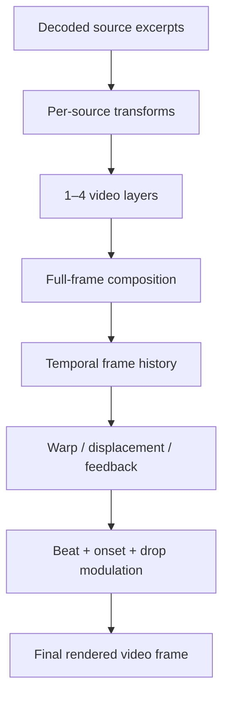

## Library layout

A library is persistent and can be reused even if an ingest run is interrupted.

```text
library/
├── metadata.sqlite3
├── originals/
├── normalized/
├── thumbnails/
├── metadata/
└── transforms/          # created when materialization is used
```

SQLite tracks discovery provenance, terms, status, source metadata, normalized media, scenes, duplicate relationships, AI scores, and scene embeddings.

Studio playback resolves normalized media first, then canonical duplicate media, downloaded originals, and compatibility paths for older libraries.


## Visual Director: motion, palette, rhythm and narrative matching

v0.21 adds a persistent temporal visual fingerprint for every indexed scene.
New ingests build this automatically. Existing libraries are backfilled
automatically on the next `analyze`/scene replan unless disabled.

Manual indexing:

```bash
tubeviz library visual-index \
  --library ./library
```

Force a complete rebuild:

```bash
tubeviz library visual-index \
  --library ./library \
  --fps 6 \
  --max-frames 180 \
  --force
```

Each scene fingerprint includes:

```text
brightness + variance
saturation
dominant hue
warmth
5-color source palette
visual complexity
visual entropy
motion magnitude / peak / entropy
approximate global motion direction
internal cut/change rate
natural visual motion accents
```

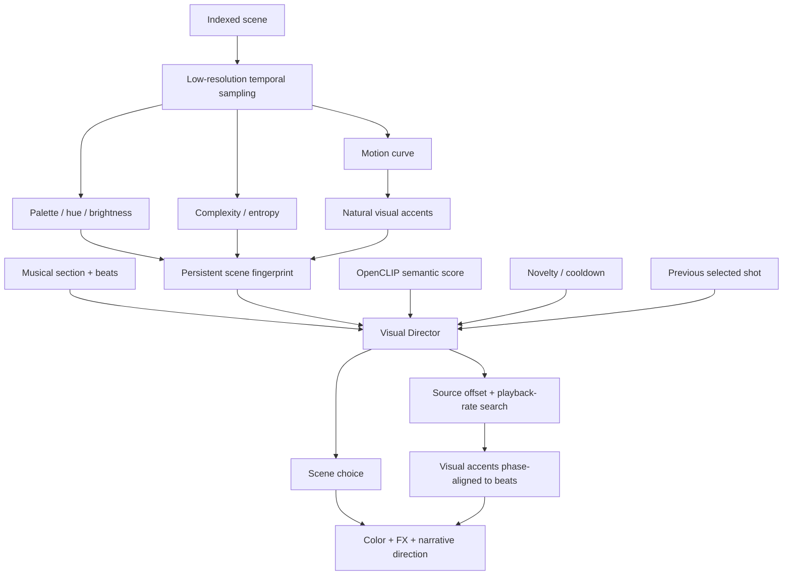

Scene ranking now combines:

```text
semantic relevance
+ visual motion compatibility
+ brightness / complexity / saturation compatibility
+ novelty and unique-source pressure
+ recent scene/clip cooldown
+ transition continuity or contrast
+ motif memory
```

Transition behavior is musical. Breakdowns and hypnotic passages prefer visual
continuity; peaks, heavy/fractured sections, and payoffs reward stronger color,
motion and brightness contrast.

Natural visual accents are used to search source offsets and modest playback
rates so existing motion in the footage can land on musical beats. This can make
camera whips, flashes, machine movement, dancer movement and other internal
visual events feel synchronized even when the source footage was unrelated to
the song.

Controls:

```text
--visual-match-weight 1.25
--transition-weight 0.70
--rhythm-alignment / --no-rhythm-alignment
--visual-auto-index / --no-visual-auto-index
```

For an aggressively directed edit:

```bash
tubeviz analyze song.mp3 \
  --library ./library \
  --semantic \
  --visual-match-weight 1.5 \
  --transition-weight 0.9 \
  --rhythm-alignment \
  --target-unique-clips 0 \
  --novelty-weight 0.75 \
  --dynamic-shots \
  --reshuffle \
  --output song.timeline.json
```

### Continuous color and effect choreography

Every selected primary shot now contains a `direction` object with:

```text
rhythm alignment score
motion compatibility
transition score
source playback rate
narrative role: introduce / develop / mutate / payoff
effect family
source and target palette direction
continuous automation curves
```

Effect families currently include `dream`, `liquid`, `analog`, `fracture`,
`hyper`, `prismatic`, and `cinematic`.

The browser renderer consumes continuous automation for:

```text
hue evolution
saturation
spectral displacement
chromatic/prismatic separation
feedback
flow/ripple
glitch
bloom
```

The effects operate on the already-composited video frame. Spectral displacement
moves strips of the actual footage using a continuously changing field, while
prismatic shifting separates hue-biased image copies according to the directed
target color. Color treatment is therefore a shot-level evolving grade rather
than a random static hue filter.

The native backend receives the directed base color treatment, including hue
rotation, and receives the major automation peaks as timed native-compatible
ripple, chroma, vortex and bloom cues.

Visual motif callbacks also acquire narrative roles. A recurring musical motif
can return to a remembered source family while changing excerpt, transform,
palette and effect treatment, creating an introduce → mutate → payoff visual
arc rather than simple clip repetition.


## Phrase-aware choreography and multi-shot planning

The v0.27 choreography layer reasons about **where the music is going**, not only
what is happening at the current instant. Each section receives a trajectory:

```text
tension / tension slope
build probability
drop probability
release probability
time to next peak
anticipation
pre-drop withholding
motion / complexity / contrast / edit-density targets
```

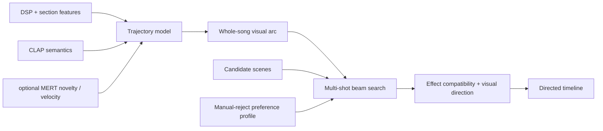

The default analysis enables phrase-aware choreography automatically. Useful
controls are:

```bash
--choreography
--trajectory-strength 0.85
--anticipation-seconds 12
--visual-arc-strength 0.70
--sequence-lookahead 5
--sequence-beam-width 6
--sequence-candidate-pool 18
--trajectory-weight 0.85
--anticipation-weight 0.75
--effect-compatibility-weight 0.60
--preference-learning
--preference-weight 0.35
```

The sequence optimizer retains multiple possible edits for a short horizon and
scores the **sequence**, including how its motion/complexity and transition
contrast evolve toward an approaching payoff. Musical timing remains
beat-aligned and deterministic.

A strong build can therefore progress approximately like:

```text
wide / clean / longer
        ↓
more motion
        ↓
more visual complexity
        ↓
shorter beat-aligned shots
        ↓
stronger transition contrast
        ↓
brief pre-drop withholding
        ↓
DROP: high-contrast source change + impact treatment
```

Inspect the stored plan:

```bash
tubeviz choreography inspect timelines/connected.json
```

JSON form:

```bash
tubeviz choreography inspect timelines/connected.json --json
```

### Optional MERT music representations

CLAP remains tubeviz's audio/text semantic model. MERT serves a different
purpose: music-specific representation **dynamics**. With MERT enabled, tubeviz
measures how rapidly the learned musical state is changing and how novel a
section is relative to the preceding one. Abrupt representation changes can
support a visual-world change; stable embeddings favor continuity.

```bash
tubeviz analyze song.mp3 \
  --library ./library \
  --music-ai \
  --music-ai-model m-a-p/MERT-v1-95M \
  --music-ai-device auto \
  --music-ai-window 8 \
  --music-ai-hop 4 \
  --audio-ai \
  --semantic \
  --output song.json
```

Check the optional runtime/device first:

```bash
tubeviz music-ai doctor
```

MERT's current Hugging Face model implementation requires
`trust_remote_code=True`; tubeviz therefore keeps it explicitly opt-in. The
`m-a-p/MERT-v1-95M` model weights are separately licensed (currently
CC-BY-NC-4.0 on the model card) and are **not** redistributed by tubeviz. Review
the model's license before using it in a commercial workflow.

### CUDA compatibility-aware `auto`

`torch.cuda.is_available()` does not guarantee that an installed PyTorch wheel
contains kernels for the actual GPU. tubeviz now compares
`torch.cuda.get_device_capability()` with `torch.cuda.get_arch_list()` before
selecting CUDA automatically. For example, a Pascal `sm_61` GPU paired with a
wheel that only contains `sm_75+` kernels falls back to CPU rather than failing
inside CLAP/OpenCLIP/MERT inference.

## Audio-semantic AI choreography

v0.26 adds a second AI layer above tubeviz's deterministic rhythm, variable-BPM,
visual-fingerprint and motif systems. It uses CLAP to interpret overlapping
windows of the actual music, projects those audio semantics onto the same
curated concept vocabulary used to interrogate OpenCLIP scene embeddings, and
then lets the existing optimizer choose real library footage.

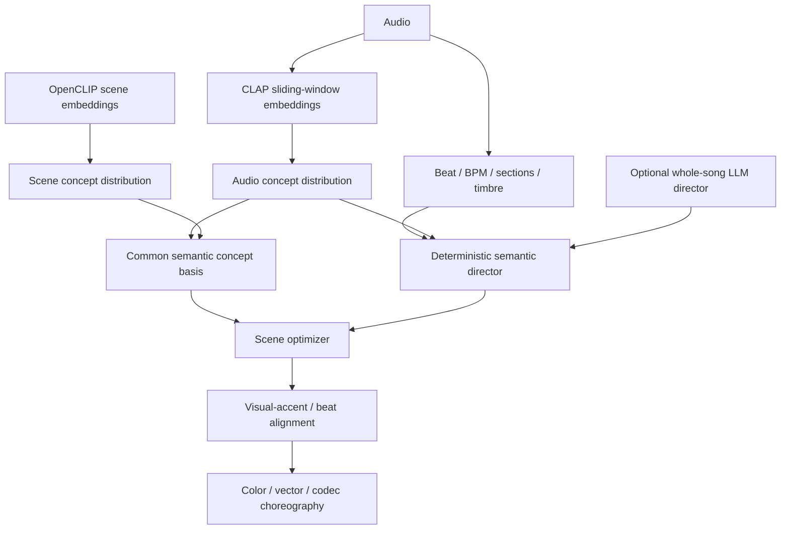

Install the optional runtime:

```bash
pip install -e '.[semantic,audio-ai,render]'
```

Check CUDA/Transformers availability:

```bash
tubeviz audio-ai doctor
```

After analysis, inspect what the model heard and how each section was directed:

```bash
tubeviz audio-ai inspect timelines/connected-ai.json
```

A recommended AI-directed analysis is:

```bash
tubeviz analyze audio/connected.mp3 \
  --library ./library \
  --semantic \
  --semantic-device cuda \
  --audio-ai \
  --audio-ai-device cuda \
  --audio-ai-window 8 \
  --audio-ai-hop 4 \
  --audio-visual-match-weight 1.10 \
  --visual-match-weight 1.35 \
  --transition-weight .55 \
  --rhythm-alignment \
  --vector-intensity .65 \
  --transform-intensity .85 \
  --composition-intensity .75 \
  --min-shot-seconds 1.0 \
  --max-shot-seconds 6 \
  --reshuffle \
  --output timelines/connected-ai.json
```

CLAP analysis defaults to `laion/clap-htsat-fused`. Audio is resampled to
48 kHz and analyzed in overlapping windows. The result is cached under
`~/.cache/tubeviz/audio-ai/`, so alternate reshuffles do not repeatedly run the
model unless `--audio-ai-force` is supplied.

Each window and musical section receives a probability distribution over a
shared audio/visual concept basis including mood, movement, visual world,
texture, palette and cinematography concepts such as `hypnotic`, `industrial`,
`forward_motion`, `rave`, `cold_blue`, `liquid`, `architecture`, `wide`, and
`fragmented`.

The cross-modal match intentionally does **not** cosine CLAP vectors directly
against OpenCLIP vectors; those models have different embedding spaces. Instead:

```text
CLAP(audio)      -> scores over shared text concepts
OpenCLIP(scene)  -> scores over the same text concepts
                           ↓
                distribution affinity
```

That affinity is weighted by CLAP confidence. High-entropy/ambiguous audio
semantics therefore have less power to override the deterministic visual and
rhythm matchers.

The semantic director also turns CLAP results into section-level targets for:

```text
visual world
motion style / desired motion
visual complexity
edit density
transition continuity vs contrast
palette / target hue
effect family
vector intensity
codec-glitch intensity
```

Edit density is quantized back onto musical beat counts, so AI can ask for a
more urgent or spacious montage but cannot move cuts off the beat grid.

### Optional whole-song LLM director

For a higher-level narrative arc, tubeviz can send a compact section summary to
any OpenAI-compatible chat-completions endpoint. The model is explicitly asked
for themes and treatment only: it cannot select filenames, clip IDs, or exact
cut times.

```bash
tubeviz analyze audio/connected.mp3 \
  --library ./library \
  --semantic \
  --audio-ai \
  --ai-director \
  --ai-director-base-url http://localhost:8000/v1 \
  --ai-director-model my-local-model \
  --ai-director-strength .70 \
  --output timelines/connected-ai-directed.json
```

If authentication is required:

```bash
--ai-director-api-key "$OPENAI_API_KEY"
```

For native OpenAI GPT-5.6 models, use the OpenAI base URL rather than the full
Chat Completions path. tubeviz automatically selects the GPT-5.6-compatible
request profile and keeps generic/local vLLM compatibility unchanged:

```bash
--ai-director-base-url https://api.openai.com/v1 \
--ai-director-model gpt-5.6-terra \
--ai-director-api-key "$OPENAI_API_KEY" \
--ai-director-reasoning-effort none \
--ai-director-max-completion-tokens 8192
```

`none` is the default reasoning effort for the AI director because its job is to
produce a structured whole-song visual plan; this prevents hidden reasoning from
consuming the completion budget before visible JSON is emitted.

The returned JSON is schema-validated and unknown fields are discarded. The
LLM plan is blended with the deterministic CLAP baseline; low CLAP confidence
reduces how strongly the language model may redirect a section. Plans are
cached under `~/.cache/tubeviz/ai-director/`.

Conceptually the authority split is:

```text
LLM / CLAP:     what should this passage feel and look like?
tubeviz:        which actual library scenes best satisfy that intent?
rhythm engine:  exactly where should cuts and accents land?
renderer:       how should pixels, vectors and codec effects execute it?
```

Studio exposes CLAP enable/device/window/hop settings, audio-to-visual match
weight, optional whole-song director URL/model/strength, and an **Audio AI
Doctor** action.

## Vector scene graph and procedural motion graphics

v0.22 adds a first-class vector scene graph to every directed shot. Vector
effects are chosen by the Visual Director from the music state, source visual
fingerprint, narrative role, motif recurrence, and effect family. They are not
random UI overlays: most primitives are derived from the actual video or are
used to mask/displace the footage.

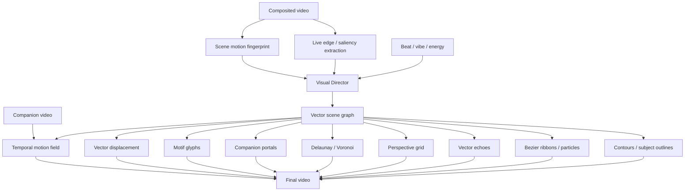

The scene graph currently contains these primitive kinds:

| Kind | Function |
|---|---|
| `contours` | Sobel-derived vector-like topology from the live video frame |
| `semantic_outline` | saliency-oriented subject contour proxy with a stable semantic-outline abstraction |
| `flow_ribbons` | Bézier motion ribbons biased by indexed source motion |
| `flow_particles` | short vector trajectories moving with the same field |
| `vector_echo` | retained edge geometry from preceding frames |
| `perspective_grid` | vanishing-point geometry biased by scene motion direction |
| `delaunay_fracture` | feature-seeded triangulation; triangles can displace/reveal the actual video |
| `voronoi` | dual geometry generated from the feature-seeded Delaunay mesh |
| `portal` | animated vector masks that reveal actual companion footage |
| `motif_glyph` | deterministic recurring symbols forming a visual alphabet for musical motifs |
| `motion_transplant` | motion extracted from a companion video deforms the primary source |
| `vector_displacement` | invisible music-driven vector geometry used only as a displacement field |

The browser renderer is the reference vector implementation. It performs
low-resolution live edge extraction, deterministic geometry caching, true
Bowyer-Watson-style Delaunay construction, Voronoi dual rendering, temporal
edge-history echoes, and temporal companion-video motion transplantation.

The native renderer also receives `VEC` records in its manifest and renders CPU
vector equivalents for contours, subject outlines, flow paths, particles,
vector echoes, perspective geometry, fracture/Voronoi geometry, motif glyphs,
displacement, and companion-video portals. The native path intentionally uses
cheaper geometry for high-throughput final rendering while preserving the same
Visual Director decisions.

Vector effects are on by default:

```bash
tubeviz analyze song.mp3 \
  --library ./library \
  --semantic \
  --vector-effects \
  --vector-intensity 1.0 \
  --output song.timeline.json
```

Disable them:

```bash
--no-vector-effects
```

Or push them harder:

```bash
--vector-intensity 1.6
```

A strongly generative EDM cut:

```bash
tubeviz analyze song.mp3 \
  --library ./library \
  --semantic \
  --visual-match-weight 1.5 \
  --transition-weight .9 \
  --rhythm-alignment \
  --vector-effects \
  --vector-intensity 1.4 \
  --max-video-layers 4 \
  --composition-intensity 1.35 \
  --transform-intensity 1.4 \
  --novelty-weight .75 \
  --dynamic-shots \
  --reshuffle \
  --output song-vector.json
```

### Motion transplantation

Motion transplantation uses a secondary video as an invisible motion source:

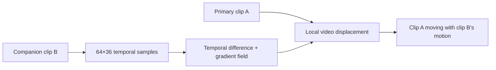

This makes effects possible such as crowd motion deforming architecture, ocean
motion deforming machinery, or a dancer's movement perturbing a city scene even
when the companion itself is mostly hidden.

### Motif glyph memory

`motif_glyph` seeds its geometry from scene/motif identity. Recurring musical
motifs therefore return with recognizable vector symbols whose rotation,
strength, color, and mutation evolve with the musical callback. The vector
system can function as a persistent visual alphabet instead of unrelated
generative shapes.


## FFglitch codec-space effects

v0.25 adds a separate **codec-space** effect domain powered by FFglitch. This is
intentionally different from tubeviz's raster glitches, vector geometry, and
optical-flow displacement. FFglitch modifies prediction/motion-vector structures
inside a supported compressed video stream, which produces true codec artifacts
that ordinary pixel filters only imitate.

FFglitch 0.10.2 documents `ffedit` as its bitstream editor and exposes MPEG-4
Part 2 features including `mv`, `mv_delta`, and macroblock information. tubeviz
therefore never assumes that arbitrary downloaded H.264/WebM clips are directly
editable. It first creates a controlled short MPEG-4 Part 2 AVI working stream,
transplicates that stream with `ffedit`, then converts the result back to a normal
H.264 MP4 cache asset for the browser/native renderers.

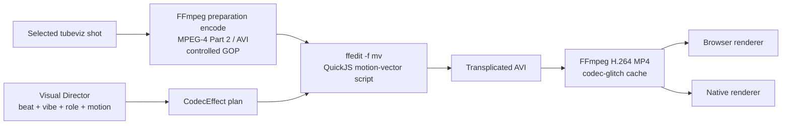

### Availability

Check the local toolchain:

```bash
tubeviz codec doctor
```

The normal successful state is roughly:

```text
available: true
ffedit: /path/to/ffedit
ffedit_version: ffglitch-0.10.2 ...
ffmpeg: /usr/bin/ffmpeg
ffgac: optional
working_codec: mpeg4
```

`ffgac` is detected and reported but the materialization path deliberately uses
standard FFmpeg for the controlled preparation/final conversion and `ffedit` for
the actual bitstream manipulation.

### Scheduling codec effects

Codec effects are **opt-in** during analysis because they are strongest when used
sparingly:

```bash
tubeviz analyze song.mp3 \
  --library ./library \
  --semantic \
  --codec-glitch musical \
  --codec-glitch-intensity .65 \
  --output song.codec-plan.json
```

Modes:

| Mode | Behavior |
|---|---|
| `off` | no codec-space effects; default |
| `subtle` | only restrained build/impact accents |
| `musical` | sparse build, mutation, fractured and payoff effects |
| `aggressive` | broader codec treatment across energetic passages |

The Visual Director currently schedules a compact vocabulary of true motion-vector
operations:

```text
mv_drift
mv_wave
mv_shear
mv_explode
mv_implode
mv_spiral
mv_jitter
mv_freeze
mv_feedback
mv_invert
mv_radial_wave
datamosh
```

A shot is capped at a small codec-effect vocabulary (normally one or two effects)
so the codec treatment remains a punctuation/transition device instead of
constant visual noise.

Inspect the exact plan before materializing:

```bash
tubeviz codec inspect song.codec-plan.json
```

JSON output:

```bash
tubeviz codec inspect song.codec-plan.json --json
```

### FFglitch 0.10.2 parameter compatibility

FFglitch's `-sp` setup-parameter parser is intentionally not used for tubeviz's
codec-effect plan. In FFglitch 0.10.2 that parser rejects floating-point JSON
values, while tubeviz effect envelopes require fractional amounts and normalized
start/end positions. tubeviz therefore embeds the deterministic JSON-compatible
effect payload directly into the generated QuickJS source as a JavaScript object
literal. This preserves full precision and still uses FFglitch's documented
`setup()` / `glitch_frame()` scripting path.

### True FFglitch materialization

Bake scheduled codec effects into deterministic cached shot assets:

```bash
tubeviz codec materialize song.codec-plan.json \
  --library ./library \
  --output song.codec.json
```

Important tuning controls:

```text
--qscale 3       MPEG-4 preparation quality
--gop 18         preparation GOP length
--fps 30         preparation frame rate
--width 1280
--height 720
--threads 0      ffedit automatic threading
--crf 18         final cached H.264 quality
--preset fast
--force          rebuild cached codec assets
```

The cache lives under:

```text
library/codec-glitch/
```

Each materialized MP4 also has a JSON provenance sidecar containing the source,
source range, FFglitch version, effect plan, preparation codec/GOP/quality, and
cache key. Cache keys include source file identity, selected range, effect plan,
and working/output parameters. Final files are written atomically so an aborted
materialization cannot be mistaken for a completed cache entry.

The materialized timeline keeps the original source media/range in
`codec_materialization`, so `--force` can regenerate from the original footage
instead of recursively glitching a previously glitched cache file.

### Render or preview in one command

Final rendering can materialize codec effects automatically:

```bash
tubeviz render song.codec-plan.json \
  --audio song.mp3 \
  --library ./library \
  --backend native \
  --codec-materialize \
  --output song-viz.mp4
```

The generated codec-materialized timeline is retained beside the output video by
default, making the render reproducible.

Browser preview can also materialize first:

```bash
tubeviz serve song.codec-plan.json \
  --audio song.mp3 \
  --library ./library \
  --codec-materialize
```

Without materialization, browser/native renderers use musically equivalent raster
fallbacks for the scheduled codec effects. This makes planning immediately
previewable while reserving the genuinely different codec artifacts for the
FFglitch materialization step.

### Codec motion as a scene-selection feature

FFglitch can export motion-vector JSON. tubeviz can use that as an optional second
motion-analysis source alongside decoded-image temporal analysis:

```bash
tubeviz library codec-motion-index \
  --library ./library
```

Force a rebuild:

```bash
tubeviz library codec-motion-index \
  --library ./library \
  --force
```

The persisted scene fingerprint gains:

```text
codec_motion
codec_motion_peak
codec_motion_direction_x
codec_motion_direction_y
codec_motion_accents
codec_motion_frames
```

Scene matching blends codec motion with the existing visual-motion estimate when
available. Natural codec-motion peaks are also merged into beat-to-visual-accent
alignment, helping source-offset/playback-rate search find moments where encoded
camera/object motion naturally lands on the music.

### Studio

Studio exposes:

```text
Codec glitch mode
Codec intensity
Materialize true FFglitch effects for browser preview
Materialize scheduled FFglitch effects before final render
FFglitch Doctor
Materialize Codec FX
Codec Motion Index
```

A productive workflow is:

```text
1. codec doctor
2. optionally build Codec Motion Index once
3. Analyze with codec-glitch=musical
4. preview using raster fallbacks while editing
5. enable FFglitch materialization for a high-fidelity preview
6. final render with codec materialization enabled
```


## Visual clip trimming in Studio

Studio can non-destructively mark the usable portion of any local library
video. This is intended for footage with title cards, channel intros, credits,
black leader, talking-head introductions, or any other portion that should
never enter a generated visualization.

Open **Library**, choose **Play / Trim**, then use the visual editor:

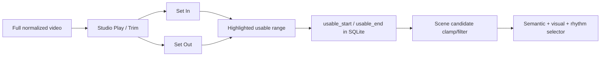

The editor provides:

- two draggable In/Out handles over the clip timeline;
- detected-scene boundary ticks and a live playhead marker;
- **Set In to Playhead** and **Set Out to Playhead**;
- jump-to-In and jump-to-Out controls;
- automatic looping of the currently kept range;
- millisecond time readouts for In, Out, and kept duration;
- **Save In / Out** and **Clear Trim**;
- a visible trim badge on library cards.

The operation is deliberately non-destructive. tubeviz does **not** rewrite or
re-encode the normalized video. The saved bounds only define which source times
are eligible for future scene plans.

For example, a 90-second clip with a 7.5-second intro can remain physically
unchanged while Studio stores:

```text
usable_start = 7.500
usable_end   = 90.000
```

A detected scene crossing a trim boundary is clipped rather than discarded when
it still has enough usable duration:

```text
indexed scene:   4.0 -------- 12.0
saved usable:        7.5 ----------------
selector sees:       7.5 ---- 12.0
```

Scenes entirely before/after the usable range disappear from scene selection.
`--min-play-scene-seconds` and related minimum-duration checks apply to the
**remaining** duration after trimming.

Visual motion-accent metadata is also shifted and filtered for a partially
trimmed scene, so beat/motion alignment cannot accidentally seek back into an
excluded intro. The persistent full-scene visual fingerprint remains intact,
which means changing or clearing trim does not require rebuilding the visual
feature index.

Library thumbnails prefer the first scene still inside the saved usable range,
so a trimmed title card no longer remains the primary Studio thumbnail when a
later scene thumbnail is available.

Existing timeline JSON is immutable: a timeline generated before a trim can
still reference its old source range. Regenerate/replan scenes after curation:

```bash
tubeviz analyze song.mp3 \
  --library ./library \
  --semantic \
  --output song.timeline.json
```

or for interactive preview:

```bash
tubeviz serve song.timeline.json \
  --audio song.mp3 \
  --library ./library \
  --replan-scenes
```


### v0.24 structural vector rendering

Visible vector rendering is intentionally sparse. Earlier vector releases could
produce a "hair" or "fur" appearance because strong edge samples were rendered
as many independent tangent strokes and flow ribbons began at pseudo-random
screen positions. v0.24 replaces both algorithms.


The browser vector renderer now:

- performs non-maximum-suppressed, hysteresis-connected edge extraction;
- traces connected components into whole contour paths instead of drawing one
  tiny line per edge sample;
- rejects short/noisy components using arc-length and bounding-area gates;
- simplifies paths with Ramer-Douglas-Peucker and smooths them before drawing;
- temporally matches/stabilizes contours against the previous extraction;
- stores complete paths in vector echo history rather than collections of short
  tangent marks;
- limits ordinary contour rendering to a handful of long paths;
- uses lower default opacity/line density.

Flow ribbons now use a local low-resolution block-matched motion field:

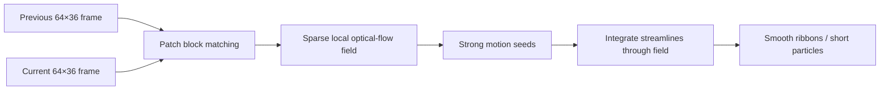

This means ribbons originate in areas that are actually moving and bend through
local motion instead of being pseudo-random tendrils biased only by one global
motion direction.

The Visual Director also applies a visible-vector budget. Non-peak shots use at
most one visible vector family; strong peaks may use two. A deterministic share
of non-peak shots deliberately has no visible vector geometry at all. Invisible
video displacement and motion-transplant effects may remain active because they
change the footage without covering it in lines.

Typical family vocabulary is now:

| Effect family | Preferred visible vectors |
|---|---|
| `dream` | contour echo or sparse connected contours |
| `liquid` | local-flow ribbons, occasional echo/portal |
| `analog` | perspective grid or sparse contours |
| `fracture` | Delaunay fracture and, at peaks, Voronoi |
| `hyper` | local-flow ribbons and impact fracture |
| `prismatic` | companion portal and Voronoi |
| `cinematic` | salient connected outline or restrained grid |

Motif glyphs are no longer continuously overlaid. They are reserved for
returning motif callbacks or peak punctuation. This preserves the visual
alphabet without making it look like a persistent logo.

The native CPU renderer was corrected in the same direction: its contour path
now groups strong edges into connected components and renders ordered paths,
while its flow approximation seeds from strong image structure rather than
random screen locations.

The browser renderer and native manifest writer also prune legacy v0.22/v0.23
timelines at runtime. Older timelines that contain the original over-dense
vector stack are reduced to the family-appropriate visible budget while all
invisible displacement effects remain available. Regenerating a timeline with
v0.24 is still recommended because the new Visual Director creates cleaner
shot-level choreography from the start, but it is not required just to remove
the old hair-like overlay.


## Recommended four-minute EDM workflow

For a large and varied source pool:

```bash
tubeviz ingest \
  --terms edm_search_terms.txt \
  --library ./library \
  --results-per-term 15 \
  --ai-discovery \
  --ai-query-expansion \
  --ai-candidates-per-term 150 \
  --ai-index-scenes \
  --cookies-from-browser chrome

tubeviz analyze song.mp3 \
  --library ./library \
  --semantic \
  --section-bars 8 \
  --dynamic-shots \
  --target-unique-clips 0 \
  --novelty-weight 0.75 \
  --source-excerpt-max-seconds 4 \
  --max-video-layers 3 \
  --transform-intensity 1.35 \
  --composition-intensity 1.25 \
  --reshuffle \
  --output song.timeline.json

tubeviz render song.timeline.json \
  --audio song.mp3 \
  --library ./library \
  --backend native \
  --native-build-if-missing \
  --width 1920 \
  --height 1080 \
  --fps 30 \
  --crf 20 \
  --output song-viz.mp4
```

This encourages many distinct clips while using only short, musically appropriate excerpts rather than exhausting each selected source sequentially.


## Studio preview selection

Studio preview servers are managed per launch. Clicking **Start Preview** now:

1. reads the current Timeline, Audio, and Library fields from Studio;
2. retires the previous Studio-managed preview process;
3. allocates a fresh local TCP port;
4. starts `tubeviz serve` with the currently selected paths; and
5. waits for Uvicorn startup before navigating the reusable preview tab.

This avoids reopening a stale in-memory timeline from an older preview server
that was still bound to the historical fixed port `8080`. Studio subprocesses
also run with `--project-root` as their working directory, so relative Timeline,
Audio, and Library paths resolve against the project selected in Studio. The preview job
payload records `preview_timeline`, `preview_audio`, `preview_library`, and
`preview_url`, and `/api/status` reports the timeline/audio currently loaded by
the visualizer server for diagnostics.

## Troubleshooting

### YouTube 403 / Forbidden

Use a current yt-dlp and, for content your browser can access:

```bash
tubeviz ingest \
  --terms search_terms.txt \
  --library ./library \
  --cookies-from-browser chrome
```

A candidate-specific failure does not invalidate the existing library; ingest continues toward the READY quota.

### Ingest appears stuck

Use bounded download settings and `--verbose-ytdlp` when diagnosing:

```bash
tubeviz ingest \
  --terms search_terms.txt \
  --library ./library \
  --download-socket-timeout 20 \
  --download-retries 2 \
  --fragment-retries 2 \
  --verbose-ytdlp
```

### Native renderer reports an unknown new argument

The Python package and cached native executable are different versions. Clean rebuild:

```bash
tubeviz native build --clean
```

### Native render is slow

Confirm the optimized native binary is actually being used:

```bash
tubeviz native doctor
```

Then try:

```bash
tubeviz render timeline.json \
  --audio song.mp3 \
  --library ./library \
  --backend native \
  --native-preset veryfast \
  --native-decoder-cache 24 \
  --native-threads 0 \
  --fps 30 \
  --output output.mp4
```

If available, `h264_nvenc` can remove software x264 encoding from the critical path.

### Studio Play says “No media”

Studio now checks actual local media availability. Inspect the record:

```bash
tubeviz library show VIDEO_ID --library ./library --json
```

A clip can exist in SQLite without having a currently resolvable local media file.

## Command reference

The CLI itself is the authoritative option reference:

```bash
tubeviz --help
tubeviz ingest --help
tubeviz library --help
tubeviz library list --help
tubeviz library show --help
tubeviz library reject --help
tubeviz library restore --help
tubeviz library delete --help
tubeviz library stats --help
tubeviz library ai-report --help
tubeviz library visual-index --help
tubeviz library codec-motion-index --help
tubeviz library embed --help
tubeviz analyze --help
tubeviz materialize --help
tubeviz render --help
tubeviz codec doctor --help
tubeviz audio-ai doctor --help
tubeviz audio-ai inspect --help
tubeviz codec inspect --help
tubeviz codec materialize --help
tubeviz native build --help
tubeviz native doctor --help
tubeviz gui --help
tubeviz serve --help
```

Top-level commands:

| Command | Purpose |
|---|---|
| `tubeviz ingest` | Search, download, normalize, scene-index and optionally AI-rank footage |
| `tubeviz library` | Inspect, curate, delete, report on and embed the persistent library |
| `tubeviz analyze` | Analyze music and produce the directed timeline |
| `tubeviz materialize` | Bake selected source transforms into cached media |
| `tubeviz render` | Render final video with native/browser/auto backend |
| `tubeviz codec` | Inspect, materialize and diagnose FFglitch codec-space effects |
| `tubeviz audio-ai` | Diagnose and inspect CLAP/AI choreography metadata |
| `tubeviz native` | Build or diagnose the native renderer |
| `tubeviz gui` | Launch Studio |
| `tubeviz serve` | Run the interactive visualizer/preview server |

## Development

Run tests:

```bash
pytest -q
```

JavaScript syntax checks:

```bash
node --check src/tubeviz/static/visualizer.js
node --check src/tubeviz/static/gui.js
```

Native build diagnostics:

```bash
tubeviz native doctor
```


### Hugging Face authentication in Studio

OpenCLIP/CLAP model downloads normally work without authentication for public models, but a Hugging Face token can be useful for authenticated, gated, or rate-limited Hub access. The preferred environment variable is `HF_TOKEN`. Studio reports whether a token is already available from its environment. If it is not, expand **Project → AI credentials** and enter a token there.

The Studio token is intentionally ephemeral: it is supplied only to tubeviz child processes as `HF_TOKEN` and is never placed in command-line arguments, job metadata, or job logs. Leaving the field blank inherits the Studio server environment. For a persistent shell setup, use for example:

```bash
export HF_TOKEN='hf_...'
tubeviz gui --library ./library
```

A read token is sufficient for downloading models.

## License

tubeviz is licensed under the **Apache License, Version 2.0**. See
[LICENSE](LICENSE) for the complete license text and [NOTICE](NOTICE) for
project notices. Source files use the SPDX identifier:

```text
SPDX-License-Identifier: Apache-2.0
```

### Third-party software, models, and media

The Apache-2.0 license applies to the **tubeviz software itself**. It does not
grant rights to third-party videos, audio, model weights, downloaded media, or
external tools used with tubeviz. In particular, FFmpeg, yt-dlp, FFglitch,
OpenCLIP, CLAP/Transformers models, PyTorch, Playwright/Chromium, and other
dependencies retain their own licenses and terms. tubeviz does not redistribute
FFglitch binaries.

Users are responsible for ensuring that media they download, import, transform,
or distribute with tubeviz is used consistently with applicable copyright law,
licenses, platform terms, and other requirements.

## Version history

Release history is maintained separately in [CHANGELOG.md](CHANGELOG.md).

## Theme-first AI footage acquisition (v0.28)

Search-term files remain supported, but the preferred ingest path is now a natural-language **visual brief**. Tubeviz can combine that brief with the song's DSP analysis and a summary of the existing library, ask an OpenAI-compatible LLM for a structured acquisition plan, and then progressively spend more compute/bandwidth only on candidates that survive each gate.

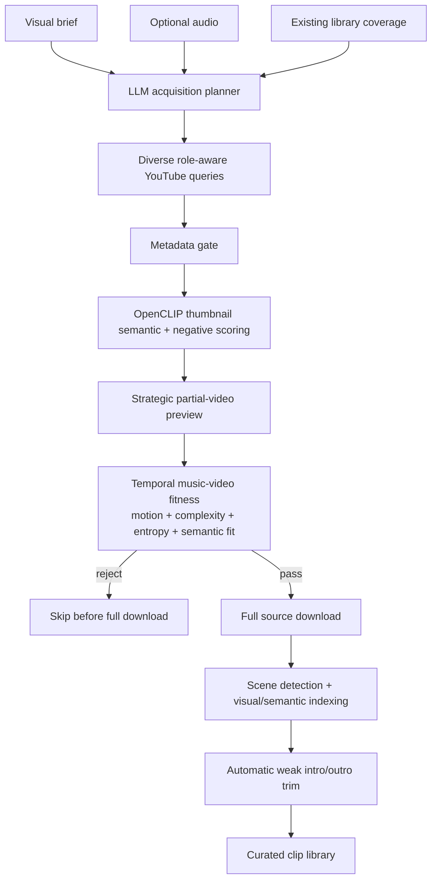

Example:

```bash
tubeviz ingest \
  --visual-brief 'Dark futuristic techno: neon tunnels, liquid chrome, rhythmic machinery, surreal architecture, rave silhouettes and euphoric high-motion drops. Avoid text, logos, talking heads, tutorials and static footage.' \
  --audio audio/connected.mp3 \
  --library ./library \
  --target-clips 40 \
  --acquisition-query-count 24 \
  --ai-llm-base-url http://localhost:8000/v1 \
  --ai-llm-model YOUR_MODEL \
  --preview-gate \
  --preview-samples 4 \
  --preview-seconds 4 \
  --min-video-fitness 0.18 \
  --auto-trim
```

With `--visual-brief`, AI discovery and the preview gate are enabled automatically. The acquisition planner distributes the requested overall target across its generated searches rather than treating every generated query as an independent large quota. If no LLM is configured, tubeviz uses a deterministic cinematography-oriented planner instead.

The preview gate samples strategic points across each hydrated candidate before committing to a full download. OpenCLIP evaluates the preview against positive visual concepts and explicit negative concepts such as title cards, logos, talking heads, tutorials, presentations and static footage. Temporal visual analysis separately measures useful motion, motion variation, complexity, entropy and cut activity. These signals form a music-video fitness score; low-fitness candidates are rejected before the expensive full ingest path.

After accepted footage is normalized and scene-indexed, tubeviz can automatically move the saved usable In/Out points past low-fitness edge scene runs. This is intended to suppress common title/logo lead-ins and static credit/outro material while preserving the existing Studio manual trim editor for correction or override.

Studio exposes the same workflow in **AI Ingest** with a Visual brief editor, optional legacy terms file, acquisition-query count, preview gate, minimum video fitness and AI auto-trim controls. The Command Center continues to expose the complete current argparse surface.
