# tubeviz

**tubeviz** is an AI-directed, video-first music visualizer. It builds a persistent local clip library from search concepts, analyzes music for rhythm/tempo/structure/vibe, selects short source excerpts intelligently, plans beat-aligned edits and transforms, previews them interactively, and renders the result through either the native C++/FFmpeg backend or the browser renderer.

Current version: **0.24.0**

## Architecture

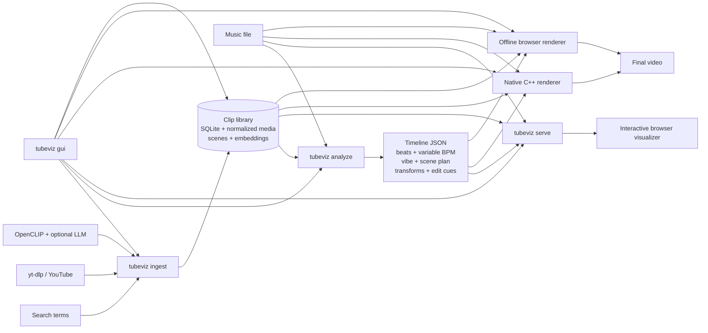

### Music-to-video direction

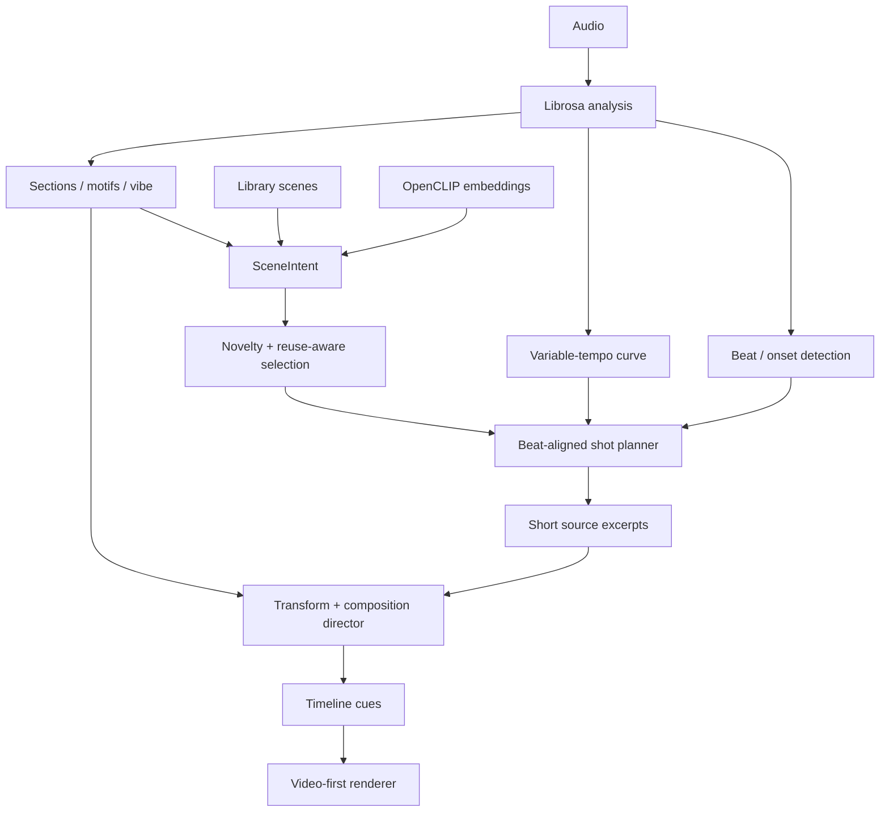

## Requirements

- Python **3.11+**
- FFmpeg / ffprobe
- yt-dlp is installed by the Python package
- Chrome/Chromium + Playwright only for the browser/offline-browser renderer
- CMake, a C++20 compiler, pkg-config, and FFmpeg development libraries for the native renderer
- OpenCLIP dependencies only when semantic/AI visual selection is wanted

Install the base project:

```bash
git clone <repo-url> tubeviz
cd tubeviz
python -m venv .venv
source .venv/bin/activate
pip install -e .
```

For development, semantic selection, AI ingest, and browser rendering:

```bash
pip install -e '.[dev,semantic,render]'
```

If using Playwright's Chromium:

```bash
playwright install chromium
```

Verify:

```bash
tubeviz --help
ffmpeg -version
```

## Quick start: Studio GUI

The easiest way to operate the current system is Studio:

```bash
tubeviz gui \
  --project-root /DATA/git/tubeviz \
  --library /DATA/git/tubeviz/library
```

It opens `http://127.0.0.1:8090/` by default.

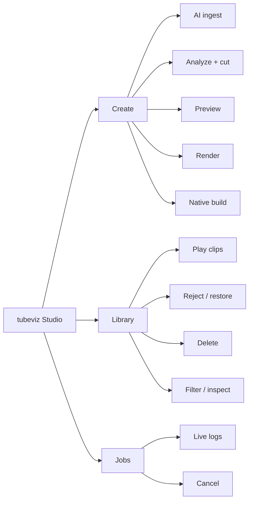

Other GUI options:

```bash
tubeviz gui --library ./library --port 8095
tubeviz gui --library ./library --no-open
tubeviz gui --host 0.0.0.0 --port 8090
```

The GUI runs the same CLI workflows described below; it is not a separate rendering implementation.

## End-to-end CLI workflow

### 1. Create search concepts

`search_terms.txt` contains one visual concept per line:

```text
underground techno warehouse strobe
laser tunnel rave crowd
analog CRT glitch surveillance
industrial machinery sparks
cyberpunk city rain neon
abstract liquid chrome macro
satellite earth night timelapse
high speed train tunnel POV
```

### 2. Ingest a clip library

Basic ingest:

```bash
tubeviz ingest \
  --terms search_terms.txt \
  --library ./library \
  --results-per-term 10 \
  --cookies-from-browser chrome
```

AI-assisted ingest:

```bash
tubeviz ingest \
  --terms search_terms.txt \
  --library ./library \
  --results-per-term 10 \
  --cookies-from-browser chrome \
  --ai-discovery \
  --ai-query-expansion \
  --ai-query-count 8 \
  --ai-candidates-per-term 100 \
  --ai-device auto \
  --ai-index-scenes
```

A more permissive source-duration configuration:

```bash
tubeviz ingest \
  --terms search_terms.txt \
  --library ./library \
  --results-per-term 10 \
  --search-pool 50 \
  --max-search-pool 500 \
  --search-pool-step 50 \
  --preferred-max-duration 1200 \
  --hard-max-duration 0 \
  --scene-threshold 0.40 \
  --min-scene-seconds 1.5 \
  --download-socket-timeout 20 \
  --concurrent-fragments 4 \
  --download-retries 2 \
  --fragment-retries 2 \
  --cookies-from-browser chrome
```

Important ingest controls:

| Option | Purpose |
|---|---|
| `--results-per-term N` | Desired READY clips per seed term |
| `--search-pool N` | Initial search result window |
| `--max-search-pool N` | Maximum progressively expanded search window |
| `--search-pool-step N` | Expansion step when the READY quota is not filled |
| `--min-duration S` | Reject clips shorter than this |
| `--preferred-max-duration S` | Soft preference for shorter videos; `0` disables |
| `--hard-max-duration S` | Hard rejection limit; `0` disables |
| `--min-width PX` | Reject narrow video; `0` disables |
| `--width/--height/--fps` | Normalized media format |
| `--scene-threshold` | FFmpeg scene-change sensitivity |
| `--min-scene-seconds` | Minimum indexed scene duration |
| `--keep-audio` | Retain AAC audio in normalized clips |
| `--no-scenes` | Skip scene detection/thumbnails |
| `--force` | Reprocess already-ready clips |
| `--cookies-from-browser BROWSER` | Use browser cookies through yt-dlp |
| `--ai-discovery` | Rank candidates visually before downloading |
| `--ai-query-expansion` | Expand seed concepts into diverse searches |
| `--ai-query-count N` | Number of expanded searches |
| `--ai-candidates-per-term N` | Candidate pool scored before download |
| `--ai-model/--ai-pretrained` | OpenCLIP configuration |
| `--ai-device auto|cpu|cuda...` | AI execution device |
| `--ai-diversity-weight` | Penalize visually redundant candidates |
| `--ai-near-duplicate-threshold` | Similarity threshold for near duplicates |
| `--ai-negative-weight` | Strength of undesirable-content penalty |
| `--ai-metadata-weight` | Metadata contribution to ranking |
| `--ai-min-score` | Reject AI candidates below score |
| `--ai-negative-concepts` | Comma-separated concepts to penalize |
| `--ai-llm-base-url/--ai-llm-model` | Optional OpenAI-compatible query-expansion model |
| `--ai-index-scenes` | Embed detected scenes while AI model is loaded |
| `--verbose-ytdlp` | Expose detailed yt-dlp diagnostics |

Active/upcoming/post-live streams are rejected. Archived finite VODs remain usable when yt-dlp exposes suitable media.

### 3. Inspect and curate the library

```bash
tubeviz library stats --library ./library
tubeviz library list --library ./library --limit 50
tubeviz library list --library ./library --status ready --term "warehouse"
tubeviz library list --library ./library --json
tubeviz library show VIDEO_ID --library ./library
tubeviz library show VIDEO_ID --library ./library --json
```

Reject without deleting:

```bash
tubeviz library reject VIDEO_ID \
  --library ./library \
  --reason "static talking-head footage"
```

Restore:

```bash
tubeviz library restore VIDEO_ID --library ./library
```

Preview a destructive deletion first:

```bash
tubeviz library delete VIDEO_ID --library ./library --dry-run
```

Delete it:

```bash
tubeviz library delete VIDEO_ID --library ./library
```

Delete without confirmation:

```bash
tubeviz library delete VIDEO_ID --library ./library --yes
```

Keep the downloaded original while removing tracked derived assets/metadata:

```bash
tubeviz library delete VIDEO_ID --library ./library --keep-original
```

Inspect persisted AI ranking:

```bash
tubeviz library ai-report --library ./library --limit 50
tubeviz library ai-report --library ./library --term "laser tunnel" --limit 25
```

Embed existing scene thumbnails:

```bash
tubeviz library embed --library ./library --device auto
```

Force regeneration:

```bash
tubeviz library embed \
  --library ./library \
  --model ViT-B-32 \
  --pretrained laion2b_s34b_b79k \
  --device cuda \
  --batch-size 64 \
  --force
```

### 4. Analyze music and build the edit

Recommended current workflow:

```bash
tubeviz analyze audio/connected.mp3 \
  --library ./library \
  --semantic \
  --semantic-device auto \
  --section-bars 8 \
  --max-video-layers 3 \
  --composition-intensity 1.2 \
  --transform-intensity 1.2 \
  --dynamic-shots \
  --min-shot-seconds 0.65 \
  --max-shot-seconds 6 \
  --source-excerpt-max-seconds 5 \
  --target-unique-clips 0 \
  --novelty-weight 0.65 \
  --reshuffle \
  --output timelines/connected.json
```

`--target-unique-clips 0` automatically scales the desired source diversity to track duration and available library size. A selected indexed scene does **not** have to play in full: `--source-excerpt-max-seconds` caps the source interval used for an individual visual shot.

For a reproducible alternate cut:

```bash
tubeviz analyze audio/connected.mp3 \
  --library ./library \
  --semantic \
  --selection-seed 48151623 \
  --selection-variation 0.30 \
  --output timelines/connected-seed.json
```

For another randomized cut:

```bash
tubeviz analyze audio/connected.mp3 \
  --library ./library \
  --semantic \
  --reshuffle \
  --output timelines/connected-alt.json
```

Key analysis groups:

| Controls | Options |
|---|---|
| Audio analysis | `--sample-rate`, `--hop-length`, `--beats-per-bar` |
| Musical sections | `--section-bars`, `--section-seconds` |
| Variable BPM | `--tempo-window-seconds`, `--tempo-smoothing-seconds`, `--tempo-curve-seconds`, `--tempo-change-bpm`, `--min-tempo`, `--max-tempo`, `--tempo-octave-min`, `--tempo-octave-max` |
| Scene selection | `--library`, `--scene-crossfade`, `--clip-opacity`, `--min-play-scene-seconds` |
| Semantic retrieval | `--semantic`, `--semantic-model`, `--semantic-pretrained`, `--semantic-device` |
| Effects | `--no-transforms`, `--transform-intensity`, `--max-video-layers`, `--composition-intensity` |
| Alternate cuts | `--selection-seed`, `--selection-variation`, `--reshuffle` |
| Diversity | `--target-unique-clips`, `--novelty-weight`, `--novelty-candidate-fraction`, `--clip-reuse-cooldown`, `--scene-reuse-cooldown` |
| Dynamic editing | `--dynamic-shots`, `--min-shot-seconds`, `--max-shot-seconds`, `--source-excerpt-max-seconds` |
| Vector direction | `--vector-effects`, `--vector-intensity` |

### Variable-BPM and vibe analysis

Long mixes are not treated as a single immutable BPM. Analysis persists a local tempo curve and emits tempo-change events after sufficiently large local shifts. Musical direction also uses section energy, brightness, onset density, spectral/timbral information, motif recurrence, and structural position to drive scene intent, edit density, composition, and transform intensity.

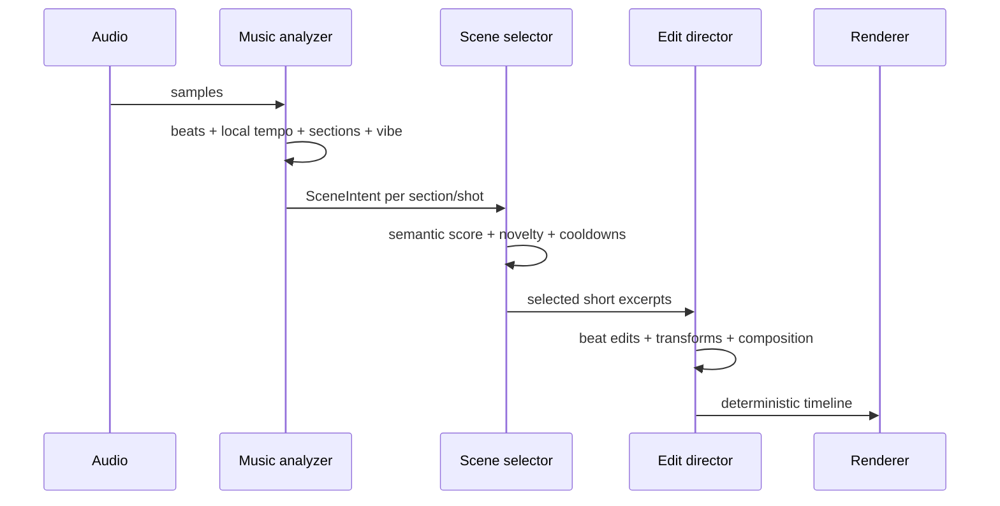

### 5. Preview interactively

```bash
tubeviz serve timelines/connected.json \
  --audio audio/connected.mp3 \
  --library ./library \
  --host 127.0.0.1 \
  --port 8080
```

Open `http://127.0.0.1:8080/`.

Re-select footage from the current library without re-analyzing audio:

```bash
tubeviz serve timelines/connected.json \
  --audio audio/connected.mp3 \
  --library ./library \
  --replan-scenes \
  --semantic \
  --reshuffle
```

Recompute transforms for an existing scene plan:

```bash
tubeviz serve timelines/connected.json \
  --audio audio/connected.mp3 \
  --library ./library \
  --replan-transforms \
  --transform-intensity 1.5
```

The `serve` replan path supports the same selection controls used by `analyze`: semantic model/device, crossfade, opacity, layers, composition intensity, seed/reshuffle, unique-clip target, novelty/cooldowns, dynamic shots, and source-excerpt limits.

Browser service endpoints:

| Endpoint | Purpose |
|---|---|
| `/` | Interactive visualizer |
| `/api/timeline` | Directed timeline |
| `/api/status` | Renderer/library status |
| `/audio` | Selected music |
| `/media/...` | Normalized clip media |
| `/transforms/...` | Materialized transform cache |
| `/ws` | Playback clock and visual cues |

### 6. Optional: materialize source transforms

Materialization bakes expensive per-source transforms into reusable files while the live renderer can still perform composition and music-reactive post-processing:

```bash
tubeviz materialize timelines/connected.json \
  --library ./library \
  --width 1280 \
  --height 720 \
  --fps 30 \
  --crf 20 \
  --preset medium \
  --output timelines/connected.materialized.json
```

Use `--force` to regenerate cached transforms.

Materialization is optional; the current renderers do not require it for all effects.

### 7. Build and inspect the native renderer

Inspect availability:

```bash
tubeviz native doctor
```

With explicit paths:

```bash
tubeviz native doctor \
  --binary ~/.cache/tubeviz/native-build/tubeviz-native-render \
  --build-dir ~/.cache/tubeviz/native-build
```

Build:

```bash
tubeviz native build
```

Clean rebuild:

```bash
tubeviz native build --clean
```

Parallel build:

```bash
tubeviz native build --clean --jobs 16
```

The native renderer uses FFmpeg/libavcodec decoding, a C++ video-effects/compositor path, decoder caching, and OpenMP where available.

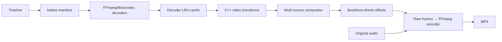

### 8. Render a final video

#### Native backend

```bash
tubeviz render timelines/connected.json \
  --audio audio/connected.mp3 \
  --library ./library \
  --output connected-native.mp4 \
  --backend native \
  --native-build-if-missing \
  --width 1920 \
  --height 1080 \
  --fps 30 \
  --crf 20 \
  --native-preset veryfast \
  --native-decoder-cache 16 \
  --native-threads 0
```

`--native-threads 0` lets OpenMP choose available workers.

For NVIDIA hardware encoding, first verify FFmpeg support:

```bash
ffmpeg -hide_banner -encoders | grep nvenc
```

Then:

```bash
tubeviz render timelines/connected.json \
  --audio audio/connected.mp3 \
  --library ./library \
  --output connected-native-nvenc.mp4 \
  --backend native \
  --video-codec h264_nvenc \
  --crf 20 \
  --native-preset fast \
  --native-decoder-cache 24 \
  --native-threads 0
```

For NVENC, tubeviz maps the quality value to FFmpeg CQ controls rather than x264-style `-crf`.

Native-specific controls:

| Option | Purpose |
|---|---|
| `--native-binary` | Explicit native renderer executable |
| `--native-build-dir` | CMake build/cache directory |
| `--native-build-if-missing` | Build when native executable is absent |
| `--native-keep-manifest` | Keep generated TSV manifest |
| `--native-preset` | Native FFmpeg encoder preset |
| `--native-decoder-cache` | Decoder contexts retained across cuts |
| `--native-threads` | OpenMP effect workers; `0` = automatic |

#### Browser backend

```bash
tubeviz render timelines/connected.json \
  --audio audio/connected.mp3 \
  --library ./library \
  --output connected-browser.mp4 \
  --backend browser \
  --width 1280 \
  --height 720 \
  --fps 30 \
  --crf 20 \
  --frame-format jpeg \
  --jpeg-quality 90 \
  --browser-executable /path/to/chrome
```

Other browser controls include `--browser-channel`, `--headed`, `--seed`, and `--page-timeout`.

#### Automatic backend selection

```bash
tubeviz render timelines/connected.json \
  --audio audio/connected.mp3 \
  --library ./library \
  --output connected.mp4 \
  --backend auto
```

`auto` prefers the native renderer when available.

Common final-render controls are `--width`, `--height`, `--fps`, `--video-codec`, `--crf`, `--preset`, `--pixel-format`, `--audio-codec`, and `--audio-bitrate`.

## Video-first effects

tubeviz intentionally transforms **rendered video**, rather than placing small rectangular clips over a conventional procedural visualizer.

The effect system includes, depending on backend support and timeline direction:

- crop/zoom/pan, mirror, rotation, playback-rate treatment;
- brightness, contrast, saturation, hue, grayscale, blur and posterization;
- feedback and recursive video tunnels;
- pixelation and RGB/chromatic displacement;
- glitch slicing and block displacement;
- scanlines, vignette and VHS-style tracking;
- ripple and beat-driven warping;
- organic mirrored/kaleidoscopic deformation rather than a persistent centered square;
- slit-scan and delayed-frame echoes;
- chroma delay and motion trails;
- datamosh-like delayed block copying;
- mask wipes, vortex treatment and slice recursion;
- multi-source single/split/mosaic/luma/strip compositions;
- beat/bar/onset/drop-driven retriggers, jumps, freezes, focus changes and effect pulses.

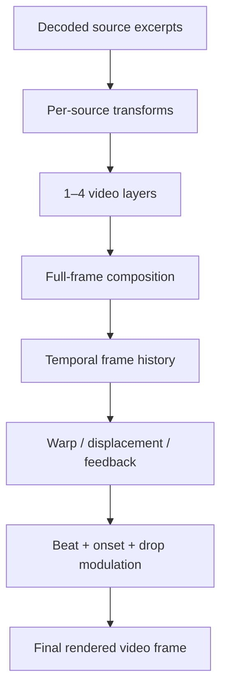

## Library layout

A library is persistent and can be reused even if an ingest run is interrupted.

```text
library/
├── metadata.sqlite3
├── originals/
├── normalized/
├── thumbnails/
├── metadata/
└── transforms/          # created when materialization is used
```

SQLite tracks discovery provenance, terms, status, source metadata, normalized media, scenes, duplicate relationships, AI scores, and scene embeddings.

Studio playback resolves normalized media first, then canonical duplicate media, downloaded originals, and compatibility paths for older libraries.


## Visual Director: motion, palette, rhythm and narrative matching

v0.21 adds a persistent temporal visual fingerprint for every indexed scene.
New ingests build this automatically. Existing libraries are backfilled
automatically on the next `analyze`/scene replan unless disabled.

Manual indexing:

```bash
tubeviz library visual-index \
  --library ./library
```

Force a complete rebuild:

```bash
tubeviz library visual-index \
  --library ./library \
  --fps 6 \
  --max-frames 180 \
  --force
```

Each scene fingerprint includes:

```text
brightness + variance
saturation
dominant hue
warmth
5-color source palette
visual complexity
visual entropy
motion magnitude / peak / entropy
approximate global motion direction
internal cut/change rate
natural visual motion accents
```

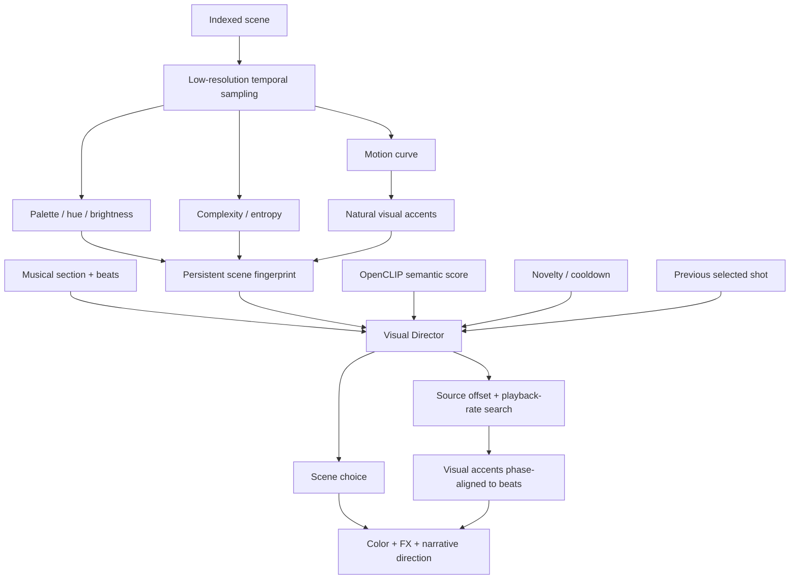

Scene ranking now combines:

```text
semantic relevance
+ visual motion compatibility
+ brightness / complexity / saturation compatibility
+ novelty and unique-source pressure
+ recent scene/clip cooldown
+ transition continuity or contrast
+ motif memory
```

Transition behavior is musical. Breakdowns and hypnotic passages prefer visual
continuity; peaks, heavy/fractured sections, and payoffs reward stronger color,
motion and brightness contrast.

Natural visual accents are used to search source offsets and modest playback
rates so existing motion in the footage can land on musical beats. This can make
camera whips, flashes, machine movement, dancer movement and other internal
visual events feel synchronized even when the source footage was unrelated to
the song.

Controls:

```text
--visual-match-weight 1.25
--transition-weight 0.70
--rhythm-alignment / --no-rhythm-alignment
--visual-auto-index / --no-visual-auto-index
```

For an aggressively directed edit:

```bash
tubeviz analyze song.mp3 \
  --library ./library \
  --semantic \
  --visual-match-weight 1.5 \
  --transition-weight 0.9 \
  --rhythm-alignment \
  --target-unique-clips 0 \
  --novelty-weight 0.75 \
  --dynamic-shots \
  --reshuffle \
  --output song.timeline.json
```

### Continuous color and effect choreography

Every selected primary shot now contains a `direction` object with:

```text
rhythm alignment score
motion compatibility
transition score
source playback rate
narrative role: introduce / develop / mutate / payoff
effect family
source and target palette direction
continuous automation curves
```

Effect families currently include `dream`, `liquid`, `analog`, `fracture`,
`hyper`, `prismatic`, and `cinematic`.

The browser renderer consumes continuous automation for:

```text
hue evolution
saturation
spectral displacement
chromatic/prismatic separation
feedback
flow/ripple
glitch
bloom
```

The effects operate on the already-composited video frame. Spectral displacement
moves strips of the actual footage using a continuously changing field, while
prismatic shifting separates hue-biased image copies according to the directed
target color. Color treatment is therefore a shot-level evolving grade rather
than a random static hue filter.

The native backend receives the directed base color treatment, including hue
rotation, and receives the major automation peaks as timed native-compatible
ripple, chroma, vortex and bloom cues.

Visual motif callbacks also acquire narrative roles. A recurring musical motif
can return to a remembered source family while changing excerpt, transform,
palette and effect treatment, creating an introduce → mutate → payoff visual
arc rather than simple clip repetition.


## Vector scene graph and procedural motion graphics

v0.22 adds a first-class vector scene graph to every directed shot. Vector
effects are chosen by the Visual Director from the music state, source visual
fingerprint, narrative role, motif recurrence, and effect family. They are not
random UI overlays: most primitives are derived from the actual video or are
used to mask/displace the footage.

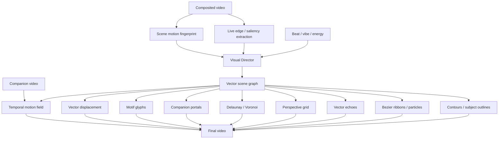

The scene graph currently contains these primitive kinds:

| Kind | Function |
|---|---|
| `contours` | Sobel-derived vector-like topology from the live video frame |
| `semantic_outline` | saliency-oriented subject contour proxy with a stable semantic-outline abstraction |
| `flow_ribbons` | Bézier motion ribbons biased by indexed source motion |
| `flow_particles` | short vector trajectories moving with the same field |
| `vector_echo` | retained edge geometry from preceding frames |
| `perspective_grid` | vanishing-point geometry biased by scene motion direction |
| `delaunay_fracture` | feature-seeded triangulation; triangles can displace/reveal the actual video |
| `voronoi` | dual geometry generated from the feature-seeded Delaunay mesh |
| `portal` | animated vector masks that reveal actual companion footage |
| `motif_glyph` | deterministic recurring symbols forming a visual alphabet for musical motifs |
| `motion_transplant` | motion extracted from a companion video deforms the primary source |
| `vector_displacement` | invisible music-driven vector geometry used only as a displacement field |

The browser renderer is the reference vector implementation. It performs
low-resolution live edge extraction, deterministic geometry caching, true
Bowyer-Watson-style Delaunay construction, Voronoi dual rendering, temporal
edge-history echoes, and temporal companion-video motion transplantation.

The native renderer also receives `VEC` records in its manifest and renders CPU
vector equivalents for contours, subject outlines, flow paths, particles,
vector echoes, perspective geometry, fracture/Voronoi geometry, motif glyphs,
displacement, and companion-video portals. The native path intentionally uses
cheaper geometry for high-throughput final rendering while preserving the same
Visual Director decisions.

Vector effects are on by default:

```bash
tubeviz analyze song.mp3 \
  --library ./library \
  --semantic \
  --vector-effects \
  --vector-intensity 1.0 \
  --output song.timeline.json
```

Disable them:

```bash
--no-vector-effects
```

Or push them harder:

```bash
--vector-intensity 1.6
```

A strongly generative EDM cut:

```bash
tubeviz analyze song.mp3 \
  --library ./library \
  --semantic \
  --visual-match-weight 1.5 \
  --transition-weight .9 \
  --rhythm-alignment \
  --vector-effects \
  --vector-intensity 1.4 \
  --max-video-layers 4 \
  --composition-intensity 1.35 \
  --transform-intensity 1.4 \
  --novelty-weight .75 \
  --dynamic-shots \
  --reshuffle \
  --output song-vector.json
```

### Motion transplantation

Motion transplantation uses a secondary video as an invisible motion source:

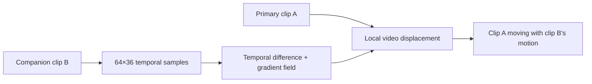

This makes effects possible such as crowd motion deforming architecture, ocean
motion deforming machinery, or a dancer's movement perturbing a city scene even
when the companion itself is mostly hidden.

### Motif glyph memory

`motif_glyph` seeds its geometry from scene/motif identity. Recurring musical
motifs therefore return with recognizable vector symbols whose rotation,
strength, color, and mutation evolve with the musical callback. The vector
system can function as a persistent visual alphabet instead of unrelated
generative shapes.


## Visual clip trimming in Studio

Studio can non-destructively mark the usable portion of any local library
video. This is intended for footage with title cards, channel intros, credits,
black leader, talking-head introductions, or any other portion that should
never enter a generated visualization.

Open **Library**, choose **Play / Trim**, then use the visual editor:

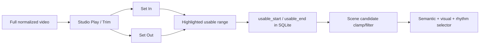

The editor provides:

- two draggable In/Out handles over the clip timeline;
- detected-scene boundary ticks and a live playhead marker;
- **Set In to Playhead** and **Set Out to Playhead**;
- jump-to-In and jump-to-Out controls;
- automatic looping of the currently kept range;
- millisecond time readouts for In, Out, and kept duration;
- **Save In / Out** and **Clear Trim**;
- a visible trim badge on library cards.

The operation is deliberately non-destructive. tubeviz does **not** rewrite or
re-encode the normalized video. The saved bounds only define which source times
are eligible for future scene plans.

For example, a 90-second clip with a 7.5-second intro can remain physically
unchanged while Studio stores:

```text
usable_start = 7.500
usable_end   = 90.000
```

A detected scene crossing a trim boundary is clipped rather than discarded when
it still has enough usable duration:

```text
indexed scene:   4.0 -------- 12.0
saved usable:        7.5 ----------------
selector sees:       7.5 ---- 12.0
```

Scenes entirely before/after the usable range disappear from scene selection.
`--min-play-scene-seconds` and related minimum-duration checks apply to the
**remaining** duration after trimming.

Visual motion-accent metadata is also shifted and filtered for a partially
trimmed scene, so beat/motion alignment cannot accidentally seek back into an
excluded intro. The persistent full-scene visual fingerprint remains intact,
which means changing or clearing trim does not require rebuilding the visual
feature index.

Library thumbnails prefer the first scene still inside the saved usable range,
so a trimmed title card no longer remains the primary Studio thumbnail when a
later scene thumbnail is available.

Existing timeline JSON is immutable: a timeline generated before a trim can
still reference its old source range. Regenerate/replan scenes after curation:

```bash
tubeviz analyze song.mp3 \
  --library ./library \
  --semantic \
  --output song.timeline.json
```

or for interactive preview:

```bash
tubeviz serve song.timeline.json \
  --audio song.mp3 \
  --library ./library \
  --replan-scenes
```


### v0.24 structural vector rendering

Visible vector rendering is intentionally sparse. Earlier vector releases could
produce a "hair" or "fur" appearance because strong edge samples were rendered
as many independent tangent strokes and flow ribbons began at pseudo-random
screen positions. v0.24 replaces both algorithms.


The browser vector renderer now:

- performs non-maximum-suppressed, hysteresis-connected edge extraction;
- traces connected components into whole contour paths instead of drawing one
  tiny line per edge sample;
- rejects short/noisy components using arc-length and bounding-area gates;
- simplifies paths with Ramer-Douglas-Peucker and smooths them before drawing;
- temporally matches/stabilizes contours against the previous extraction;
- stores complete paths in vector echo history rather than collections of short
  tangent marks;
- limits ordinary contour rendering to a handful of long paths;
- uses lower default opacity/line density.

Flow ribbons now use a local low-resolution block-matched motion field:

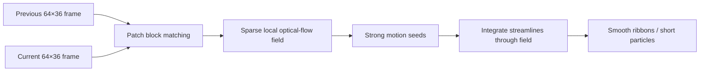

This means ribbons originate in areas that are actually moving and bend through
local motion instead of being pseudo-random tendrils biased only by one global
motion direction.

The Visual Director also applies a visible-vector budget. Non-peak shots use at
most one visible vector family; strong peaks may use two. A deterministic share
of non-peak shots deliberately has no visible vector geometry at all. Invisible
video displacement and motion-transplant effects may remain active because they
change the footage without covering it in lines.

Typical family vocabulary is now:

| Effect family | Preferred visible vectors |
|---|---|
| `dream` | contour echo or sparse connected contours |
| `liquid` | local-flow ribbons, occasional echo/portal |
| `analog` | perspective grid or sparse contours |
| `fracture` | Delaunay fracture and, at peaks, Voronoi |
| `hyper` | local-flow ribbons and impact fracture |
| `prismatic` | companion portal and Voronoi |
| `cinematic` | salient connected outline or restrained grid |

Motif glyphs are no longer continuously overlaid. They are reserved for
returning motif callbacks or peak punctuation. This preserves the visual
alphabet without making it look like a persistent logo.

The native CPU renderer was corrected in the same direction: its contour path
now groups strong edges into connected components and renders ordered paths,
while its flow approximation seeds from strong image structure rather than
random screen locations.

The browser renderer and native manifest writer also prune legacy v0.22/v0.23
timelines at runtime. Older timelines that contain the original over-dense
vector stack are reduced to the family-appropriate visible budget while all
invisible displacement effects remain available. Regenerating a timeline with
v0.24 is still recommended because the new Visual Director creates cleaner
shot-level choreography from the start, but it is not required just to remove
the old hair-like overlay.


## Recommended four-minute EDM workflow

For a large and varied source pool:

```bash
tubeviz ingest \
  --terms edm_search_terms.txt \
  --library ./library \
  --results-per-term 15 \
  --ai-discovery \
  --ai-query-expansion \
  --ai-candidates-per-term 150 \
  --ai-index-scenes \
  --cookies-from-browser chrome

tubeviz analyze song.mp3 \
  --library ./library \
  --semantic \
  --section-bars 8 \
  --dynamic-shots \
  --target-unique-clips 0 \
  --novelty-weight 0.75 \
  --source-excerpt-max-seconds 4 \
  --max-video-layers 3 \
  --transform-intensity 1.35 \
  --composition-intensity 1.25 \
  --reshuffle \
  --output song.timeline.json

tubeviz render song.timeline.json \
  --audio song.mp3 \
  --library ./library \
  --backend native \
  --native-build-if-missing \
  --width 1920 \
  --height 1080 \
  --fps 30 \
  --crf 20 \
  --output song-viz.mp4
```

This encourages many distinct clips while using only short, musically appropriate excerpts rather than exhausting each selected source sequentially.

## Troubleshooting

### YouTube 403 / Forbidden

Use a current yt-dlp and, for content your browser can access:

```bash
tubeviz ingest \
  --terms search_terms.txt \
  --library ./library \
  --cookies-from-browser chrome
```

A candidate-specific failure does not invalidate the existing library; ingest continues toward the READY quota.

### Ingest appears stuck

Use bounded download settings and `--verbose-ytdlp` when diagnosing:

```bash
tubeviz ingest \
  --terms search_terms.txt \
  --library ./library \
  --download-socket-timeout 20 \
  --download-retries 2 \
  --fragment-retries 2 \
  --verbose-ytdlp
```

### Native renderer reports an unknown new argument

The Python package and cached native executable are different versions. Clean rebuild:

```bash
tubeviz native build --clean
```

### Native render is slow

Confirm the optimized native binary is actually being used:

```bash
tubeviz native doctor
```

Then try:

```bash
tubeviz render timeline.json \
  --audio song.mp3 \
  --library ./library \
  --backend native \
  --native-preset veryfast \
  --native-decoder-cache 24 \
  --native-threads 0 \
  --fps 30 \
  --output output.mp4
```

If available, `h264_nvenc` can remove software x264 encoding from the critical path.

### Studio Play says “No media”

Studio now checks actual local media availability. Inspect the record:

```bash
tubeviz library show VIDEO_ID --library ./library --json
```

A clip can exist in SQLite without having a currently resolvable local media file.

## Command reference

The CLI itself is the authoritative option reference:

```bash
tubeviz --help
tubeviz ingest --help
tubeviz library --help
tubeviz library list --help
tubeviz library show --help
tubeviz library reject --help
tubeviz library restore --help
tubeviz library delete --help
tubeviz library stats --help
tubeviz library ai-report --help
tubeviz library visual-index --help
tubeviz library embed --help
tubeviz analyze --help
tubeviz materialize --help
tubeviz render --help
tubeviz native build --help
tubeviz native doctor --help
tubeviz gui --help
tubeviz serve --help
```

Top-level commands:

| Command | Purpose |
|---|---|
| `tubeviz ingest` | Search, download, normalize, scene-index and optionally AI-rank footage |
| `tubeviz library` | Inspect, curate, delete, report on and embed the persistent library |
| `tubeviz analyze` | Analyze music and produce the directed timeline |
| `tubeviz materialize` | Bake selected source transforms into cached media |
| `tubeviz render` | Render final video with native/browser/auto backend |
| `tubeviz native` | Build or diagnose the native renderer |
| `tubeviz gui` | Launch Studio |
| `tubeviz serve` | Run the interactive visualizer/preview server |

## Development

Run tests:

```bash
pytest -q
```

JavaScript syntax checks:

```bash
node --check src/tubeviz/static/visualizer.js
node --check src/tubeviz/static/gui.js
```

Native build diagnostics:

```bash
tubeviz native doctor
```

## Version history

Release history is maintained separately in [CHANGELOG.md](CHANGELOG.md).
